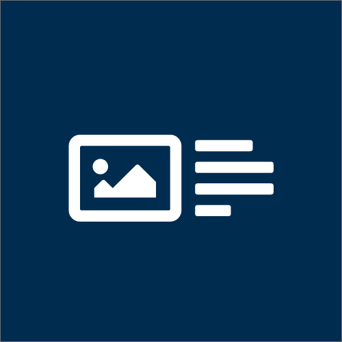

# Content Types & Templates for .net CMSs

> This is a [2sxc](https://2sxc.org) App for [DNN ☢️](https://www.dnnsoftware.com/) and [Oqtane 💧](https://www.oqtane.org/)

These are the primary **Content** parts for 2sxc 12.05 supporting many CSS Frameworks.

| Aspect              | Status | Comments or Version |
| ------------------- | :----: | ------------------- |
| 2sxc                | ✅    | requires 2sxc v12.05
| Dnn                 | ✅    | For v7, v8 and v9
| Oqtane 2            | ✅    | Requires v2.02
| No jQuery           | ✅    | 
| Live Demo           | ➖    |
| Install Checklist   | ✅    | see below
| Source & License    | ✅    | included, ISC/MIT
| App Catalog         | ✅    | See [app catalog](https://2sxc.org/en/apps/app/accordion-v3-for-2sxc)
| Screenshots         | ✅    | See [app catalog](https://2sxc.org/en/apps/app/accordion-v3-for-2sxc)
| Best Practices      | ✅    | Uses v12.05 conventions
| Bootstrap 3         | ✅    | Optimized for v3.3
| Bootstrap 4         | ✅    | Optimised for latest v4
| Bootstrap 5         | ✅    | Optimized for v5.1

Other CSS frameworks: please contribute

The Multi-CSS-Framework implementation uses [Connect.Koi][koi]. Here some thumbnails of the result:

You can read more about the included content-types and templates in this [blog-post](http://2sxc.org/en/blog/post/27-responsive-bootstrap3-structured-content-design-templates-for-dnn-and-2sxc)

## Purpose

Each DNN portal using [2sxc][2sxc] has a section called **Content** which contains the main content-types and main templates. This could be initialized manually, but in most cases it's more efficient to install a set of best-practice content-types and templates. To ensure this stuff looks good, these content-types and templates should be optimized to the CSS-framework in use.

## Quick-Start

1. Almost everything you want to know is in the [wiki](https://github.com/2sic/2sxc-content-app/wiki)
1. **Installation**: Whenever you install 2sxc on a DNN portal, or when you create a new portal on a [DNN with 2sxc installed](http://2sxc.org/en/Learn/Install-2sxc), 2sxc will automatically ask you to install this. If you need to know more, read about [installations in the wiki](https://github.com/2sic/2sxc-content-app/wiki/Installation-Instructions).

## Customize the App

1. **Skin/Theme Optimizations**: We have some recommendations, if you care about this, read about the [optimizations in the wiki](https://github.com/2sic/2sxc-content-app/wiki/Theme-Optimizations)
1. **Customize to your colors and CSS**: check out the [instructions in the wiki](https://github.com/2sic/2sxc-content-app/wiki/Customizing%20CSS%20or%20SASS)

## Questions and Support

1. We from 2sxc use [StackOverflow with the tag 2sxc][StackOverflow] for support. Post your questions there.
2. Real issues can be posted in [issues](https://github.com/2sic/2sxc-content-app/issues)

[2sxc]:https://2sxc.org
[StackOverflow]:http://stackoverflow.com/questions/tagged/2sxc
[SCSS]:http://sass-lang.com/
[koi]:https://connect-koi.net/

## History

* v12.00 2021-05-04 released for 2sxc 12, now compatible with Oqtane as well
  * 2sxc 12 supports hybrid Apps which run on Dnn ☢️ and Oqtane 💧. These content-templates are the first generation of such apps. 
* v12.04 2021-09-02 released for 2sxc 12.04 
  * [major clean-up - see blog](https://2sxc.org/en/blog/post/content-is-now-70-off-get-it-asap)
  * also minor changes for Oqtane 2.2 which is now Bootstrap5
* v12.05 2021-10
  * updated for 2sxc 12.05 and clean npm issues
  * enhanced all use cases of `Link.Image(...)` to use latest features
  * renamed partial files to better match latest conventions
  * reorganized files
  * Moved icons to /Icons for clearer structure
* v13.01 2022-01
  * extended clickable space of _List of links view
  * changed datamodel of basic content and video views to list
  * basic content and video views can now be alternated
* v13.01.01 2022-03
  * Bugfix bs4 banner
* v13.01.02 2022-03
  * Bugfix video list