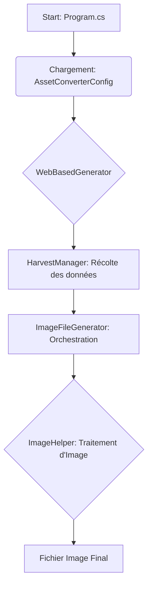

# Cartographie du Code - Flux de Génération d'Images

Ce document cartographie le processus de génération d'images dans le projet `Argumentum.AssetConverter` afin de clarifier les responsabilités de chaque composant et de faciliter le débogage.

## 1. Vue d'ensemble du Flux

Le processus de génération d'images est orchestré en plusieurs étapes clés, en commençant par la configuration jusqu'à la création finale du fichier image sur le disque.

## 2. Description des Composants

### `Program.cs`
- **Rôle :** Point d'entrée de l'application console.
- **Responsabilités :**
    - Parse les arguments de la ligne de commande.
    - Charge le fichier principal `AssetConverterConfig.json`.
    - Instancie et exécute les principaux services en fonction du mode opératoire demandé (ex: génération de PDF, validation, etc.).

### `AssetConverterConfig.cs`
- **Rôle :** Modèle de données principal pour toute la configuration de l'outil.
- **Responsabilités :**
    - Contient toutes les sous-configurations, y compris `WebBasedGeneratorConfig`, `LocalizationConfig`, etc.
    - Est sérialisé/désérialisé à partir du fichier `AssetConverterConfig.json`.

### `WebBasedGenerator/` (Répertoire)
Ce répertoire contient la logique métier principale pour la génération d'assets à partir de sources web ou locales.

#### `WebBasedGenerator.cs`
- **Rôle :** Chef d'orchestre du processus de génération web.
- **Responsabilités :**
    - Initialise le `HarvestManager` pour collecter les données sources.
    - Initialise le `ImageFileGenerator` pour traiter ces données.
    - Coordonne le flux entre la récolte et la génération.

#### `HarvestManager.cs`
- **Rôle :** Collecteur de données.
- **Responsabilités :**
    - Lit les configurations des `CardSetDocumentConfig`.
    - "Récolte" (scrape, lit depuis un cache, etc.) les informations nécessaires, comme les URLs des images de cartes (faces et dos).
    - Retourne un `ConcurrentDictionary` (`harvestDictionary`) qui mappe un set de cartes et une langue à une fonction qui fournit les données récoltées (`CardSetHarvest`).

#### `ImageFileGenerator.cs`
- **Rôle :** Orchestrateur de la création des fichiers images.
- **Responsabilités :**
    - Reçoit le `harvestDictionary` de `HarvestManager`.
    - Itère sur les documents et les langues à traiter.
    - Appelle une méthode de traitement d'image pour chaque image de carte.
    - **Point Critique :** C'est ici que l'appel à la méthode d'extension `LoadAndProcessImageUrl` est effectué sur un objet `DocumentCardSet`.

### `ImageHelper.cs` (Fichier Suspecté)
- **Rôle :** Fournisseur de méthodes utilitaires pour la manipulation d'images.
- **Responsabilités :**
    - **Hypothèse :** Ce fichier contient la définition de la méthode d'extension `LoadAndProcessImageUrl(this DocumentCardSet ..., string imageUrl, ...)`.
    - **Logique Clé :** Cette méthode est le cœur du problème. Elle est responsable de :
        1.  Identifier si `imageUrl` est une URL web (http/https) ou un chemin de fichier local.
        2.  Si c'est une URL, la télécharger.
        3.  Si c'est un fichier local, le lire directement.
        4.  Appliquer les transformations d'image (redimensionnement, effets, etc.) via `Magick.NET` selon la configuration.
        5.  Sauvegarder l'image traitée dans le répertoire de sortie cible.
        6.  Retourner le chemin complet du fichier final, ou `null`/`string.Empty` en cas d'échec.

## 3. Analyse du Bug Actuel (`ImageFileGeneratorTests`)

Le bug des tests qui échouent provient d'une mauvaise interaction avec `LoadAndProcessImageUrl`.

1.  **Problème :** Les tests créent des fichiers images factices locaux et passent ensuite à `ImageFileGenerator` un `harvestDictionary` contenant ces chemins locaux comme "URLs".
2.  **Point de défaillance :** La méthode `LoadAndProcessImageUrl` ne semble pas interpréter correctement le chemin de fichier local. Elle le traite comme une URL invalide, ce qui provoque un échec silencieux et retourne une chaîne vide.
3.  **Conséquence :** `ImageFileGenerator` ne reçoit jamais de chemin de fichier valide, n'ajoute rien à sa liste de résultats, et les tests échouent car ils attendent un résultat non vide.

Pour résoudre ce bug, il est impératif d'analyser le code de `LoadAndProcessImageUrl` dans `ImageHelper.cs` pour comprendre et corriger sa logique de gestion des chemins.