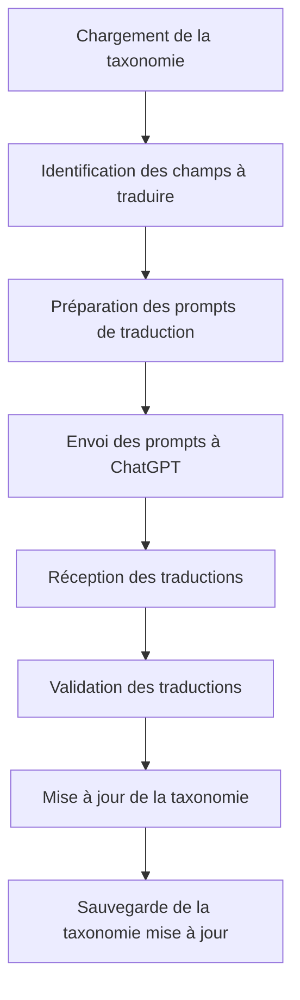
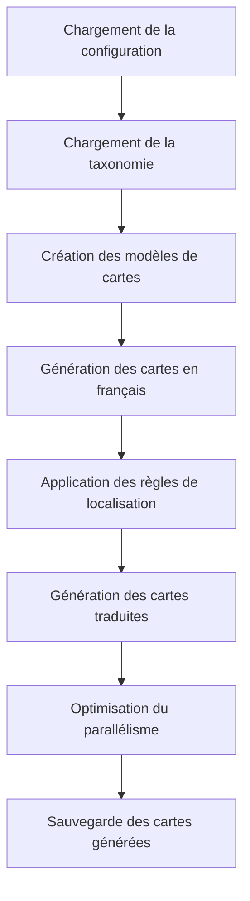

# Processus Multilingue d'Argumentum

Ce document détaille le processus multilingue utilisé dans le projet Argumentum pour gérer la traduction et la génération des cartes dans différentes langues.

## Structure de la taxonomie multilingue

La taxonomie des sophismes d'Argumentum est structurée de manière à faciliter la traduction et la gestion multilingue. Elle est organisée comme suit :

### Format de données

La taxonomie est stockée dans des fichiers CSV avec la structure suivante :

```
Id,Famille,Sous-Famille,Soussousfamille,text_fr,desc_fr,example_fr,link_fr,text_en,desc_en,example_en,link_en,...
```

Chaque sophisme (fallacy) possède :
- Un identifiant unique (`Id`)
- Une classification hiérarchique (`Famille`, `Sous-Famille`, `Soussousfamille`)
- Des champs de contenu pour chaque langue (`text_XX`, `desc_XX`, `example_XX`, `link_XX`)

### Langues supportées

Le système prend actuellement en charge les langues suivantes :
- Français (fr) - Langue de base
- Anglais (en)
- Russe (ru)
- Portugais (pt)

### Correspondance des champs

Pour chaque langue, les champs suivants sont traduits :

| Champ français | Champ anglais | Champ russe | Champ portugais |
|----------------|---------------|-------------|-----------------|
| Famille        | Family        | Family_ru   | Family_pt       |
| Sous-Famille   | Subfamily     | Subfamily_ru| Subfamily_pt    |
| Soussousfamille| Subsubfamily  | Subsubfamily_ru | Subsubfamily_pt |
| text_fr        | text_en       | text_ru     | text_pt         |
| desc_fr        | desc_en       | desc_ru     | desc_pt         |
| example_fr     | example_en    | example_ru  | example_pt      |
| link_fr        | link_en       | link_ru     | link_pt         |

## Processus de traduction avec ChatGPT

Le processus de traduction utilise ChatGPT pour traduire automatiquement le contenu de la taxonomie. Ce processus est géré par le composant `DatasetUpdater`.

### Étapes du processus de traduction



1. **Chargement de la taxonomie** : Le système charge le fichier CSV de taxonomie.
2. **Identification des champs à traduire** : Le système identifie les champs qui nécessitent une traduction.
3. **Préparation des prompts de traduction** : Des prompts spécifiques sont préparés pour ChatGPT, incluant le contexte et les instructions de traduction.
4. **Envoi des prompts à ChatGPT** : Les prompts sont envoyés à l'API ChatGPT.
5. **Réception des traductions** : Les traductions sont reçues de ChatGPT.
6. **Validation des traductions** : Les traductions sont validées pour s'assurer de leur qualité et de leur cohérence.
7. **Mise à jour de la taxonomie** : La taxonomie est mise à jour avec les nouvelles traductions.
8. **Sauvegarde de la taxonomie mise à jour** : La taxonomie mise à jour est sauvegardée dans le fichier CSV.

### Prompts de traduction

Les prompts de traduction sont conçus pour fournir à ChatGPT le contexte nécessaire pour produire des traductions précises et cohérentes. Voici un exemple de prompt pour la traduction du français vers l'anglais :

```
Tu es un expert en argumentation et en logique, spécialisé dans les sophismes (fallacies).
Ta tâche est de traduire du français vers l'anglais les descriptions de sophismes suivantes,
en respectant la terminologie spécifique du domaine.

Sophisme : Ad Hominem
Description française : "Attaquer la personne plutôt que son argument."
Traduction anglaise : 
```

Les prompts sont personnalisés pour chaque langue cible et incluent des exemples de traductions précédentes pour assurer la cohérence terminologique.

### Gestion des fichiers de ressources

Les prompts et les exemples de traduction sont stockés dans des fichiers de ressources dans le répertoire `DatasetUpdater/Resources` :

- `PromptTranslateFrEnInstructionsUser.txt` : Instructions pour la traduction du français vers l'anglais
- `PromptTranslatePtInstructionsUser.txt` : Instructions pour la traduction vers le portugais
- `PromptTranslateRuInstructionsUser.txt` : Instructions pour la traduction vers le russe
- `PromptTranslateCleanupInstructionsUser.txt` : Instructions pour le nettoyage des traductions

## Génération des cartes dans différentes langues

Une fois la taxonomie traduite, le système génère les cartes dans différentes langues en utilisant le composant `WebBasedGenerator`.

### Configuration de localisation

La configuration de localisation est définie dans la classe `LocalizationConfig` qui spécifie :
- Les langues supportées
- Les correspondances entre les champs français et leurs équivalents dans d'autres langues
- Les règles de conversion pour chaque type de carte

### Processus de génération multilingue



1. **Chargement de la configuration** : Le système charge la configuration de localisation.
2. **Chargement de la taxonomie** : La taxonomie traduite est chargée.
3. **Création des modèles de cartes** : Des modèles de cartes sont créés pour chaque type de carte.
4. **Génération des cartes en français** : Les cartes sont d'abord générées en français.
5. **Application des règles de localisation** : Les règles de localisation sont appliquées pour chaque langue cible.
6. **Génération des cartes traduites** : Les cartes sont générées dans chaque langue cible.
7. **Optimisation du parallélisme** : Le processus est optimisé pour générer les cartes en parallèle.
8. **Sauvegarde des cartes générées** : Les cartes générées sont sauvegardées dans les répertoires correspondants.

### Structure des répertoires multilingues

Les cartes générées sont organisées dans une structure de répertoires par langue :

```
Target/
├── fr/
│   ├── Images/
│   ├── Documents/
│   └── Harvest/
├── en/
│   ├── Images/
│   ├── Documents/
│   └── Harvest/
├── ru/
│   ├── Images/
│   ├── Documents/
│   └── Harvest/
└── pt/
    ├── Images/
    ├── Documents/
    └── Harvest/
```

## Validation et tests

Le système inclut plusieurs mécanismes de validation pour assurer la qualité des traductions et des cartes générées :

1. **Validation de la taxonomie** : Vérifie la structure et la cohérence de la taxonomie.
2. **Validation des traductions** : Vérifie la complétude et la cohérence des traductions.
3. **Validation des cartes générées** : Vérifie que toutes les cartes ont été correctement générées dans toutes les langues.
4. **Rapport de couverture des traductions** : Génère des rapports sur la couverture des traductions pour chaque langue et type de champ.

Pour plus de détails sur les processus de validation, consultez le document [ValidationSystem.md](ValidationSystem.md).

## Conclusion

Le processus multilingue d'Argumentum est conçu pour faciliter la création et la maintenance de cartes dans plusieurs langues. Il combine des techniques de traduction automatique avec des mécanismes de validation robustes pour assurer la qualité et la cohérence des traductions.

Pour plus d'informations sur la couverture des traductions, consultez le document [TranslationCoverage.md](TranslationCoverage.md).