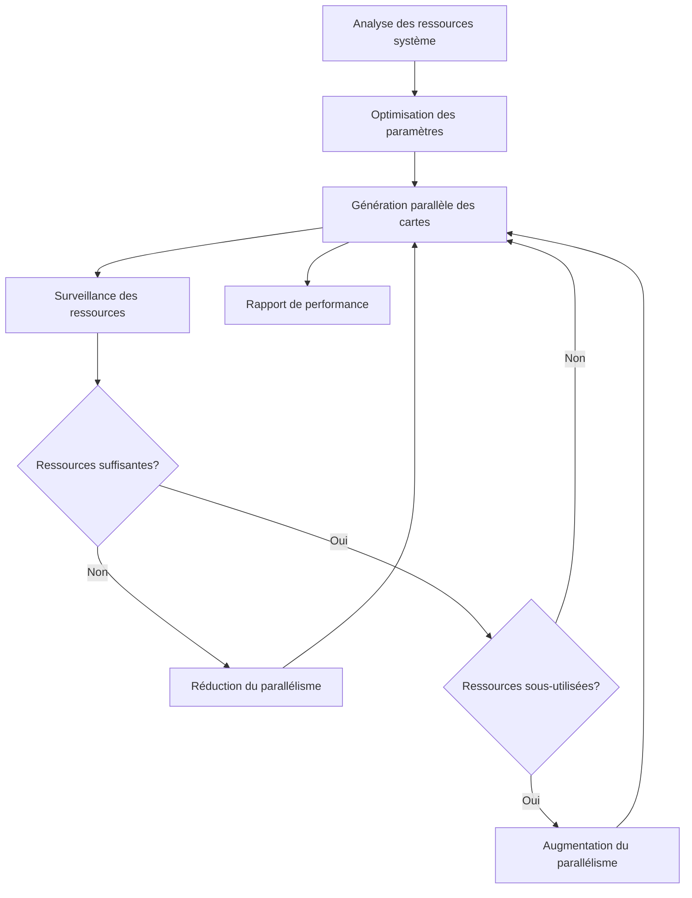

# Système d'Optimisation du Parallélisme d'Argumentum

Ce document détaille le système d'optimisation du parallélisme utilisé dans le projet Argumentum pour maximiser les performances de génération des cartes dans différentes langues.

## Vue d'ensemble

Le système d'optimisation du parallélisme est conçu pour :
- Analyser les ressources système disponibles (CPU, mémoire, disque, réseau)
- Optimiser les paramètres de parallélisme en fonction des ressources
- Surveiller et ajuster dynamiquement les paramètres pendant la génération
- Générer des rapports de performance pour l'analyse et l'amélioration



## Analyse des ressources système

L'analyse des ressources système est effectuée par la classe `ParallelismOptimizer` et configurée via `ParallelismOptimizerConfig`.

### Configuration

```csharp
public class ParallelismOptimizerConfig
{
    public bool Enabled { get; set; } = true;
    public bool RunBeforeGeneration { get; set; } = true;
    public bool DynamicAdjustment { get; set; } = true;
    public int MonitoringIntervalSeconds { get; set; } = 5;
    public int TargetCpuUsagePercent { get; set; } = 80;
    public int TargetMemoryUsagePercent { get; set; } = 70;
    public double CpuWeightFactor { get; set; } = 1.0;
    public double MemoryWeightFactor { get; set; } = 0.8;
    public double DiskWeightFactor { get; set; } = 0.5;
    public double NetworkWeightFactor { get; set; } = 0.3;
    public string PerformanceReportPath { get; set; } = "ParallelismPerformanceReport.json";
    public bool GenerateDetailedReport { get; set; } = true;
    public int MinThreadsCardpen { get; set; } = 1;
    public int MinThreadsCardpenTranslations { get; set; } = 1;
    public int MinThreadsImages { get; set; } = 1;
    public int MinThreadsImageTranslations { get; set; } = 1;
    public int MinThreadsDocuments { get; set; } = 1;
    // ...
}
```

### Analyse du CPU

L'analyse du CPU évalue le nombre de cœurs disponibles et l'utilisation actuelle du processeur :

```csharp
private async Task<CpuInfo> AnalyzeCpu()
{
    var cpuInfo = new CpuInfo();
    
    // Obtenir le nombre de processeurs logiques
    cpuInfo.ProcessorCount = Environment.ProcessorCount;
    
    try
    {
        // Obtenir le nom du processeur et d'autres informations
        if (RuntimeInformation.IsOSPlatform(OSPlatform.Windows))
        {
            using (var searcher = new ManagementObjectSearcher("SELECT * FROM Win32_Processor"))
            {
                foreach (var obj in searcher.Get())
                {
                    cpuInfo.ProcessorName = obj["Name"]?.ToString() ?? "Unknown";
                    break;
                }
            }
        }
        else
        {
            // Pour Linux/macOS
            cpuInfo.ProcessorName = "Non-Windows CPU";
        }
        
        // Mesurer l'utilisation actuelle du CPU
        var startTime = DateTime.UtcNow;
        var startCpuUsage = Process.GetCurrentProcess().TotalProcessorTime;
        
        await Task.Delay(500);
        
        var endTime = DateTime.UtcNow;
        var endCpuUsage = Process.GetCurrentProcess().TotalProcessorTime;
        
        var cpuUsedMs = (endCpuUsage - startCpuUsage).TotalMilliseconds;
        var totalMsPassed = (endTime - startTime).TotalMilliseconds;
        var cpuUsageTotal = cpuUsedMs / (Environment.ProcessorCount * totalMsPassed);
        
        cpuInfo.CurrentUsagePercent = (int)(cpuUsageTotal * 100);
        
        // Obtenir l'utilisation globale du système
        if (RuntimeInformation.IsOSPlatform(OSPlatform.Windows))
        {
            using (var searcher = new ManagementObjectSearcher("SELECT * FROM Win32_PerfFormattedData_PerfOS_Processor WHERE Name='_Total'"))
            {
                foreach (var obj in searcher.Get())
                {
                    cpuInfo.SystemUsagePercent = Convert.ToInt32(obj["PercentProcessorTime"]);
                    break;
                }
            }
        }
    }
    catch (Exception ex)
    {
        Logger.LogWarning($"Erreur lors de l'analyse du CPU: {ex.Message}");
        // Valeurs par défaut en cas d'erreur
        cpuInfo.CurrentUsagePercent = 50;
        cpuInfo.SystemUsagePercent = 50;
    }
    
    return cpuInfo;
}
```

### Analyse de la mémoire

L'analyse de la mémoire évalue la quantité de mémoire disponible et son utilisation actuelle :

```csharp
private async Task<MemoryInfo> AnalyzeMemory()
{
    var memoryInfo = new MemoryInfo();
    
    try
    {
        if (RuntimeInformation.IsOSPlatform(OSPlatform.Windows))
        {
            using (var searcher = new ManagementObjectSearcher("SELECT * FROM Win32_OperatingSystem"))
            {
                foreach (var obj in searcher.Get())
                {
                    memoryInfo.TotalPhysicalMemory = Convert.ToInt64(obj["TotalVisibleMemorySize"]) * 1024; // KB to bytes
                    memoryInfo.AvailablePhysicalMemory = Convert.ToInt64(obj["FreePhysicalMemory"]) * 1024; // KB to bytes
                    break;
                }
            }
        }
        else
        {
            // Pour Linux/macOS
            memoryInfo.TotalPhysicalMemory = GC.GetGCMemoryInfo().TotalAvailableMemoryBytes;
            memoryInfo.AvailablePhysicalMemory = memoryInfo.TotalPhysicalMemory / 2; // Estimation
        }
        
        memoryInfo.UsedPhysicalMemory = memoryInfo.TotalPhysicalMemory - memoryInfo.AvailablePhysicalMemory;
        memoryInfo.UsagePercent = (int)((double)memoryInfo.UsedPhysicalMemory / memoryInfo.TotalPhysicalMemory * 100);
        
        // Obtenir l'utilisation de la mémoire du processus actuel
        using (var process = Process.GetCurrentProcess())
        {
            memoryInfo.ProcessMemoryUsage = process.WorkingSet64;
        }
    }
    catch (Exception ex)
### Analyse du disque

L'analyse du disque évalue l'espace disque disponible et les performances de lecture/écriture :

```csharp
private async Task<DiskInfo> AnalyzeDisk()
{
    var diskInfo = new DiskInfo();
    
    try
    {
        // Obtenir les informations sur l'espace disque
        var currentDirectory = Environment.CurrentDirectory;
        var driveInfo = new DriveInfo(Path.GetPathRoot(currentDirectory));
        
        diskInfo.TotalSpace = driveInfo.TotalSize;
        diskInfo.AvailableSpace = driveInfo.AvailableFreeSpace;
        diskInfo.UsedSpace = diskInfo.TotalSpace - diskInfo.AvailableSpace;
        diskInfo.UsagePercent = (int)((double)diskInfo.UsedSpace / diskInfo.TotalSpace * 100);
        
        // Mesurer les performances de lecture/écriture
        var tempFile = Path.Combine(Path.GetTempPath(), Guid.NewGuid().ToString() + ".tmp");
        const int bufferSize = 1024 * 1024 * 10; // 10 MB
        var buffer = new byte[bufferSize];
        new Random().NextBytes(buffer);
        
        // Test d'écriture
        var stopwatch = Stopwatch.StartNew();
        using (var fs = new FileStream(tempFile, FileMode.Create, FileAccess.Write))
        {
            await fs.WriteAsync(buffer, 0, buffer.Length);
            await fs.FlushAsync();
        }
        stopwatch.Stop();
        var writeTime = stopwatch.ElapsedMilliseconds;
        diskInfo.AverageWriteSpeed = bufferSize / (1024.0 * 1024.0) / (writeTime / 1000.0);
        
        // Test de lecture
        stopwatch.Restart();
        using (var fs = new FileStream(tempFile, FileMode.Open, FileAccess.Read))
        {
            await fs.ReadAsync(buffer, 0, buffer.Length);
        }
        stopwatch.Stop();
        var readTime = stopwatch.ElapsedMilliseconds;
        diskInfo.AverageReadSpeed = bufferSize / (1024.0 * 1024.0) / (readTime / 1000.0);
        
        // Nettoyer
        try
        {
            File.Delete(tempFile);
        }
        catch
        {
            // Ignorer les erreurs de nettoyage
        }
    }
    catch (Exception ex)
    {
        Logger.LogWarning($"Erreur lors de l'analyse du disque: {ex.Message}");
        // Valeurs par défaut en cas d'erreur
        diskInfo.TotalSpace = 500L * 1024 * 1024 * 1024; // 500 GB
        diskInfo.AvailableSpace = 250L * 1024 * 1024 * 1024; // 250 GB
        diskInfo.UsedSpace = 250L * 1024 * 1024 * 1024; // 250 GB
        diskInfo.UsagePercent = 50;
        diskInfo.AverageReadSpeed = 100; // 100 MB/s
        diskInfo.AverageWriteSpeed = 50; // 50 MB/s
    }
    
    return diskInfo;
}
```

### Analyse du réseau

L'analyse du réseau évalue la bande passante disponible et la latence :

```csharp
private async Task<NetworkInfo> AnalyzeNetwork()
{
    var networkInfo = new NetworkInfo();
    
    try
    {
        // Mesurer la latence
        var pingTasks = new List<Task<long>>();
        var hosts = new[] { "8.8.8.8", "1.1.1.1", "208.67.222.222" }; // Google DNS, Cloudflare DNS, OpenDNS
        
        foreach (var host in hosts)
        {
            pingTasks.Add(Task.Run(async () =>
            {
                try
                {
                    using (var ping = new Ping())
                    {
                        var reply = await ping.SendPingAsync(host, 1000);
                        return reply.Status == IPStatus.Success ? reply.RoundtripTime : 0;
                    }
                }
                catch
                {
                    return 0;
                }
            }));
        }
        
        await Task.WhenAll(pingTasks);
        var validPings = pingTasks.Select(t => t.Result).Where(r => r > 0).ToList();
        networkInfo.AverageLatency = validPings.Any() ? validPings.Average() : 50; // Valeur par défaut: 50ms
        
        // Estimer la bande passante en fonction des interfaces réseau actives
        var activeNetworkInterfaces = NetworkInterface.GetAllNetworkInterfaces()
            .Where(ni => ni.OperationalStatus == OperationalStatus.Up &&
                        (ni.NetworkInterfaceType == NetworkInterfaceType.Wireless80211 ||
                         ni.NetworkInterfaceType == NetworkInterfaceType.Ethernet))
            .ToList();
        
        if (activeNetworkInterfaces.Any())
        {
            // Prendre la vitesse maximale parmi les interfaces actives
            networkInfo.AverageBandwidth = activeNetworkInterfaces.Max(ni => ni.Speed) / 1_000_000.0; // bits/s to Mbps
        }
        else
        {
            networkInfo.AverageBandwidth = 100; // Valeur par défaut: 100 Mbps
        }
    }
    catch (Exception ex)
    {
        Logger.LogWarning($"Erreur lors de l'analyse du réseau: {ex.Message}");
        // Valeurs par défaut en cas d'erreur
        networkInfo.AverageLatency = 50; // 50 ms
        networkInfo.AverageBandwidth = 100; // 100 Mbps
    }
    
    return networkInfo;
}
```

## Optimisation des paramètres

L'optimisation des paramètres de parallélisme est effectuée en fonction des ressources système disponibles :

```csharp
public void OptimizeParallelismParameters(AssetConverterConfig config)
{
    // Calculer les paramètres optimaux
    var cpuCores = _resourceInfo.CpuInfo.ProcessorCount;
    var memoryAvailableGB = _resourceInfo.MemoryInfo.AvailablePhysicalMemory / (1024.0 * 1024 * 1024);
    var diskSpeedFactor = Math.Min(_resourceInfo.DiskInfo.AverageReadSpeed / 100.0, 1.0); // Normaliser à 100 MB/s
    var networkFactor = Math.Min(_resourceInfo.NetworkInfo.AverageBandwidth / 100.0, 1.0); // Normaliser à 100 Mbps
    
    // Facteur global basé sur les ressources disponibles et leur pondération
    var cpuFactor = (1.0 - (_resourceInfo.CpuInfo.SystemUsagePercent / 100.0)) * _config.CpuWeightFactor;
    var memoryFactor = (1.0 - (_resourceInfo.MemoryInfo.UsagePercent / 100.0)) * _config.MemoryWeightFactor;
    var resourceFactor = (cpuFactor + memoryFactor + diskSpeedFactor * _config.DiskWeightFactor + networkFactor * _config.NetworkWeightFactor) / 
                        (_config.CpuWeightFactor + _config.MemoryWeightFactor + _config.DiskWeightFactor + _config.NetworkWeightFactor);
    
    // Calculer les valeurs optimales en fonction des ressources
    var optimalCardpen = Math.Max(
        _config.MinThreadsCardpen,
        (int)Math.Round(cpuCores * 0.5 * resourceFactor)
    );
    
    var optimalCardpenTranslations = Math.Max(
        _config.MinThreadsCardpenTranslations,
        (int)Math.Round(cpuCores * 0.3 * resourceFactor)
    );
    
    var optimalImages = Math.Max(
        _config.MinThreadsImages,
        (int)Math.Round(cpuCores * 0.6 * resourceFactor)
    );
    
    var optimalImageTranslations = Math.Max(
        _config.MinThreadsImageTranslations,
        (int)Math.Round(cpuCores * 0.4 * resourceFactor)
    );
    
    var optimalDocuments = Math.Max(
        _config.MinThreadsDocuments,
        (int)Math.Round(cpuCores * 0.7 * resourceFactor)
    );
    
    // Appliquer les valeurs optimisées
    config.WebBasedGeneratorConfig.MaxDegreeOfParallelismCardpen = optimalCardpen;
    config.WebBasedGeneratorConfig.MaxDegreeOfParallelismCardpenTranslations = optimalCardpenTranslations;
    config.WebBasedGeneratorConfig.MaxDegreeOfParallelismImages = optimalImages;
    config.WebBasedGeneratorConfig.MaxDegreeOfParallelismImageTranslations = optimalImageTranslations;
    config.WebBasedGeneratorConfig.MaxDegreeOfParallelismDocuments = optimalDocuments;
}
```

## Surveillance des ressources

Le système peut surveiller les ressources système pendant la génération et ajuster dynamiquement les paramètres de parallélisme :

```csharp
public void StartResourceMonitoring(AssetConverterConfig config)
{
    if (!_config.DynamicAdjustment)
    {
        return;
    }
    
    _monitoringTask = Task.Run(async () =>
    {
        try
        {
            Logger.Log("Surveillance des ressources système démarrée.");
            
            while (!_monitoringCts.Token.IsCancellationRequested)
            {
                await Task.Delay(TimeSpan.FromSeconds(_config.MonitoringIntervalSeconds), _monitoringCts.Token);
                
                try
                {
                    // Analyser les ressources actuelles
                    var currentResources = await AnalyzeSystemResources();
                    
                    // Vérifier si un ajustement est nécessaire
                    if (currentResources.CpuInfo.SystemUsagePercent > _config.TargetCpuUsagePercent ||
                        currentResources.MemoryInfo.UsagePercent > _config.TargetMemoryUsagePercent)
                    {
                        Logger.LogWarning($"Utilisation élevée des ressources détectée: CPU {currentResources.CpuInfo.SystemUsagePercent}%, Mémoire {currentResources.MemoryInfo.UsagePercent}%");
                        
                        // Réduire le parallélisme
                        AdjustParallelismParameters(config, 0.8);
                    }
                    else if (currentResources.CpuInfo.SystemUsagePercent < _config.TargetCpuUsagePercent * 0.7 &&
                             currentResources.MemoryInfo.UsagePercent < _config.TargetMemoryUsagePercent * 0.7)
                    {
                        Logger.Log($"Utilisation faible des ressources détectée: CPU {currentResources.CpuInfo.SystemUsagePercent}%, Mémoire {currentResources.MemoryInfo.UsagePercent}%");
                        
                        // Augmenter le parallélisme
                        AdjustParallelismParameters(config, 1.2);
                    }
                }
                catch (Exception ex)
                {
                    Logger.LogWarning($"Erreur lors de la surveillance des ressources: {ex.Message}");
                }
            }
        }
        catch (Exception ex)
        {
            Logger.LogWarning($"Erreur dans la tâche de surveillance: {ex.Message}");
        }
        finally
        {
            Logger.Log("Surveillance des ressources système arrêtée.");
        }
    });
}
```

## Rapports de performance

Le système génère des rapports de performance détaillés pour analyser et améliorer le processus de génération :

```csharp
public async Task GeneratePerformanceReport()
{
    _performanceReport.EndTime = DateTime.Now;
    _performanceReport.TotalDuration = _performanceReport.EndTime - _performanceReport.StartTime;
    
    // Ajouter des recommandations basées sur les ajustements effectués
    if (_performanceReport.ResourceAdjustments.Count > 0)
    {
        var cpuAdjustments = _performanceReport.ResourceAdjustments.Where(a => a.CpuUsage > _config.TargetCpuUsagePercent).Count();
        var memoryAdjustments = _performanceReport.ResourceAdjustments.Where(a => a.MemoryUsage > _config.TargetMemoryUsagePercent).Count();
        
        if (cpuAdjustments > memoryAdjustments)
        {
            _performanceReport.Recommendations.Add("Le CPU semble être le facteur limitant. Envisagez de réduire le parallélisme global ou d'améliorer les performances du CPU.");
        }
        else if (memoryAdjustments > cpuAdjustments)
        {
            _performanceReport.Recommendations.Add("La mémoire semble être le facteur limitant. Envisagez d'augmenter la mémoire disponible ou de réduire la consommation mémoire des opérations.");
        }
    }
    
    // Sauvegarder le rapport au format JSON
    if (_config.GenerateDetailedReport)
    {
        try
        {
            var reportJson = JsonSerializer.Serialize(_performanceReport, new JsonSerializerOptions { WriteIndented = true });
            await File.WriteAllTextAsync(_config.PerformanceReportPath, reportJson);
            Logger.LogSuccess($"Rapport de performance généré: {_config.PerformanceReportPath}");
        }
        catch (Exception ex)
        {
            Logger.LogWarning($"Erreur lors de la génération du rapport de performance: {ex.Message}");
        }
    }
}
```

## Optimisation des paramètres de parallélisme

### Paramètres clés

Les paramètres de parallélisme contrôlent le nombre de tâches parallèles pour différentes opérations :

| Paramètre | Description | Valeur par défaut |
|-----------|-------------|------------------|
| MaxDegreeOfParallelismCardpen | Nombre maximum de tâches parallèles pour la génération de cartes Cardpen | Basé sur les ressources |
| MaxDegreeOfParallelismCardpenTranslations | Nombre maximum de tâches parallèles pour la traduction de cartes Cardpen | Basé sur les ressources |
| MaxDegreeOfParallelismImages | Nombre maximum de tâches parallèles pour la génération d'images | Basé sur les ressources |
| MaxDegreeOfParallelismImageTranslations | Nombre maximum de tâches parallèles pour la traduction d'images | Basé sur les ressources |
| MaxDegreeOfParallelismDocuments | Nombre maximum de tâches parallèles pour la génération de documents | Basé sur les ressources |

### Facteurs de pondération

Les facteurs de pondération déterminent l'importance relative des différentes ressources système :

| Facteur | Description | Valeur par défaut |
|---------|-------------|------------------|
| CpuWeightFactor | Importance du CPU | 1.0 |
| MemoryWeightFactor | Importance de la mémoire | 0.8 |
| DiskWeightFactor | Importance du disque | 0.5 |
| NetworkWeightFactor | Importance du réseau | 0.3 |

### Cibles d'utilisation

Les cibles d'utilisation définissent les niveaux d'utilisation des ressources que le système essaie de maintenir :

| Cible | Description | Valeur par défaut |
|-------|-------------|------------------|
| TargetCpuUsagePercent | Pourcentage cible d'utilisation du CPU | 80% |
| TargetMemoryUsagePercent | Pourcentage cible d'utilisation de la mémoire | 70% |

## Recommandations pour l'optimisation du parallélisme

Voici quelques recommandations pour optimiser le parallélisme dans le projet Argumentum :

1. **Ajuster les facteurs de pondération** : Modifiez les facteurs de pondération en fonction de l'importance relative des ressources système pour votre cas d'utilisation spécifique.

2. **Ajuster les cibles d'utilisation** : Modifiez les cibles d'utilisation en fonction de la capacité de votre système et de vos préférences en matière de performances.

3. **Activer l'ajustement dynamique** : Activez l'ajustement dynamique pour permettre au système d'ajuster automatiquement les paramètres de parallélisme pendant la génération.

4. **Analyser les rapports de performance** : Analysez les rapports de performance générés pour identifier les goulots d'étranglement et les opportunités d'amélioration.

5. **Optimiser les ressources système** : Améliorez les ressources système (CPU, mémoire, disque, réseau) pour augmenter les performances globales.

## Conclusion

Le système d'optimisation du parallélisme d'Argumentum permet d'optimiser les performances de génération des cartes dans différentes langues en ajustant automatiquement les paramètres de parallélisme en fonction des ressources système disponibles. Il combine une analyse détaillée des ressources, une optimisation intelligente des paramètres, une surveillance dynamique et des rapports de performance pour maximiser l'efficacité du processus de génération.

Pour plus d'informations sur le processus de génération multilingue, consultez le document [MultilingualProcess.md](MultilingualProcess.md).
    {
        Logger.LogWarning($"Erreur lors de l'analyse de la mémoire: {ex.Message}");
        // Valeurs par défaut en cas d'erreur
        memoryInfo.TotalPhysicalMemory = 8L * 1024 * 1024 * 1024; // 8 GB
        memoryInfo.AvailablePhysicalMemory = 4L * 1024 * 1024 * 1024; // 4 GB
        memoryInfo.UsedPhysicalMemory = 4L * 1024 * 1024 * 1024; // 4 GB
        memoryInfo.UsagePercent = 50;
    }
    
    return memoryInfo;
}