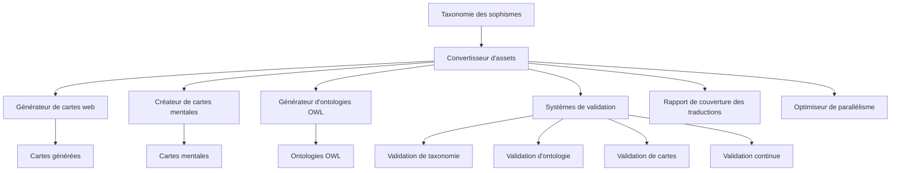
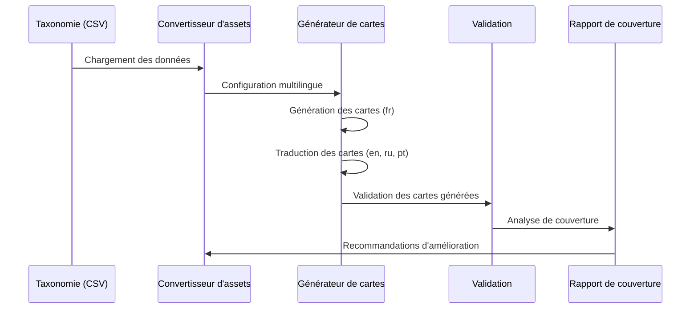

# Argumentum - Vue d'ensemble du projet

## Introduction

Argumentum est un projet éducatif qui vise à enseigner l'art de l'argumentation et à sensibiliser aux sophismes (fallacies) à travers un jeu de cartes. Le projet comprend un système complet de génération de cartes, de documentation et de validation dans plusieurs langues (français, anglais, russe et portugais).

Ce document fournit une vue d'ensemble du projet Argumentum et de son fonctionnement multilingue, en mettant l'accent sur le système de génération et de traduction des cartes.

## Architecture générale

Le système Argumentum est composé de plusieurs composants interconnectés :



### Composants principaux

1. **Convertisseur d'assets (AssetConverter)** : Le composant central qui orchestre la génération de tous les assets du projet.
2. **Générateur de cartes web (WebBasedGenerator)** : Génère les cartes du jeu dans différentes langues.
3. **Créateur de cartes mentales (Mindmapper)** : Crée des représentations visuelles de la taxonomie des sophismes.
4. **Générateur d'ontologies OWL** : Crée des ontologies formelles pour représenter la taxonomie des sophismes.
5. **Systèmes de validation** : Vérifie la cohérence et la qualité des assets générés.
6. **Rapport de couverture des traductions** : Analyse et rapporte la couverture des traductions dans différentes langues.
7. **Optimiseur de parallélisme** : Optimise les performances de génération en fonction des ressources système disponibles.

## Flux de travail multilingue

Le processus multilingue d'Argumentum suit les étapes suivantes :



1. **Chargement des données** : Les données de taxonomie sont chargées à partir de fichiers CSV.
2. **Configuration multilingue** : Le système est configuré pour générer des assets dans plusieurs langues.
3. **Génération des cartes** : Les cartes sont d'abord générées en français (langue de base).
4. **Traduction des cartes** : Les cartes sont traduites dans d'autres langues (anglais, russe, portugais).
5. **Validation** : Les cartes générées sont validées pour assurer leur cohérence et leur qualité.
6. **Analyse de couverture** : Un rapport de couverture des traductions est généré pour suivre la progression.

## Guide de démarrage rapide

Pour utiliser le système Argumentum, suivez ces étapes :

1. **Installation** : Clonez le dépôt et assurez-vous que toutes les dépendances sont installées.

2. **Configuration** : Modifiez le fichier `AssetConverterConfig.json` selon vos besoins.

3. **Exécution** : Lancez l'application avec la commande suivante :
   ```
   Argumentum.AssetConverter.exe
   ```

4. **Options de ligne de commande** : Utilisez les options de ligne de commande pour des fonctionnalités spécifiques :
   - `--validate-taxonomy` : Valide la taxonomie des sophismes
   - `--validate-owl` : Valide les ontologies OWL générées
   - `--validate-cards` : Valide les cartes générées
   - `--continuous-validation` : Active la validation continue
   - `--translation-coverage` : Génère un rapport de couverture des traductions
   - `--optimize-parallelism` : Optimise les paramètres de parallélisme

5. **Résultats** : Les assets générés se trouvent dans le répertoire `Target` organisé par langue.

Pour plus de détails sur chaque composant et processus, consultez les documents spécifiques dans ce répertoire de documentation.