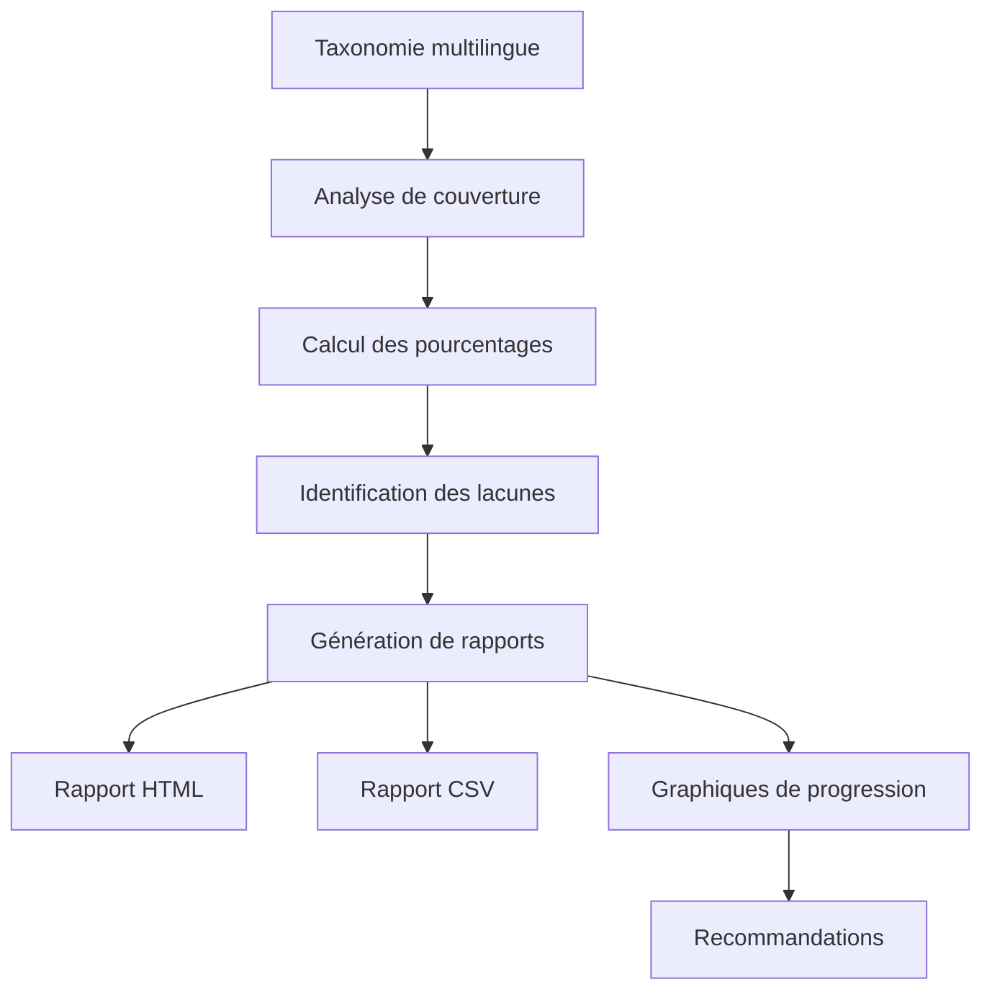

# Système de Couverture des Traductions d'Argumentum

Ce document détaille le système de couverture des traductions utilisé dans le projet Argumentum pour suivre et améliorer la qualité des traductions dans les différentes langues supportées.

## Vue d'ensemble

Le système de couverture des traductions est conçu pour :
- Analyser la complétude des traductions dans chaque langue
- Générer des rapports détaillés sur la couverture des traductions
- Suivre la progression des traductions au fil du temps
- Identifier les zones nécessitant des améliorations



## Analyse de la couverture

L'analyse de la couverture des traductions est effectuée par la classe `TranslationCoverageReport` et configurée via `TranslationCoverageConfig`.

### Configuration

```csharp
public class TranslationCoverageConfig
{
    public List<string> Languages { get; set; } = new List<string> { "fr", "en", "ru", "pt" };
    public List<string> FieldTypes { get; set; } = new List<string> { "Text", "Desc", "Example", "Link" };
    public int MinimumCoverageThreshold { get; set; } = 80;
    public string CoverageReportPath { get; set; } = Path.Combine("Output", "TranslationCoverage", "translation_coverage_report.html");
    public string CsvReportPath { get; set; } = Path.Combine("Output", "TranslationCoverage", "translation_coverage_report.csv");
    public string CoverageHistoryDirectory { get; set; } = Path.Combine("Output", "TranslationCoverage", "History");
    public int MaxHistoryReports { get; set; } = 10;
    public bool GenerateProgressCharts { get; set; } = true;
    public bool HighlightLowCoverageSections { get; set; } = true;
    public int TopLowCoverageSectionsCount { get; set; } = 5;
    // ...
}
```

### Processus d'analyse

Le processus d'analyse de la couverture des traductions suit les étapes suivantes :

1. **Chargement des données de taxonomie** : Le système charge les données de taxonomie à partir du fichier CSV.

```csharp
private async Task<List<Fallacy>> LoadTaxonomyData()
{
    // Déterminer le chemin du fichier de taxonomie
    string taxonomyFilePath = _config.UseDebugParams
        ? _config.DataSets.FirstOrDefault(ds => ds.Name == KnownDataSets.FallaciesTaxonomy)?.DebugFilePath
        : _config.DataSets.FirstOrDefault(ds => ds.Name == KnownDataSets.FallaciesTaxonomy)?.ReleaseFilePath;

    // Charger et parser le fichier CSV
    string csvContent = await File.ReadAllTextAsync(taxonomyFilePath);
    return ParseCsvContent(csvContent);
}
```

2. **Analyse de la couverture par langue et type de champ** : Pour chaque langue et type de champ, le système calcule le pourcentage de champs traduits.

```csharp
private void AnalyzeCoverage(List<Fallacy> fallacies)
{
    // Regrouper les fallacies par famille
    var fallaciesByFamily = fallacies.GroupBy(f => f.Famille).ToDictionary(g => g.Key, g => g.ToList());

    // Pour chaque langue (sauf le français qui est la langue de base)
    foreach (var language in _coverageConfig.Languages.Where(l => l != "fr"))
    {
        // Pour chaque famille
        foreach (var family in fallaciesByFamily.Keys)
        {
            var familyFallacies = fallaciesByFamily[family];
            
            // Pour chaque type de champ
            foreach (var fieldType in _coverageConfig.FieldTypes)
            {
                int totalFields = familyFallacies.Count;
                int translatedFields = 0;

                // Compter les champs traduits
                foreach (var fallacy in familyFallacies)
                {
                    string frValue = GetFallacyProperty(fallacy, "fr", fieldType);
                    string translatedValue = GetFallacyProperty(fallacy, language, fieldType);

                    if (!string.IsNullOrEmpty(frValue) && !string.IsNullOrEmpty(translatedValue))
                    {
                        translatedFields++;
                    }
                    else if (!string.IsNullOrEmpty(frValue) && string.IsNullOrEmpty(translatedValue))
                    {
                        // Ajouter à la liste des traductions manquantes
                        _missingTranslations[language][fieldType].Add($"{family} - {fallacy.Id} - {fieldType}");
                    }
                }

                // Calculer le pourcentage de couverture
                double coverage = totalFields > 0 ? (double)translatedFields / totalFields * 100 : 0;
                _coverageData[language][fieldType][family] = coverage;
            }
        }
    }
}
```

3. **Calcul des pourcentages de couverture globale** : Le système calcule les pourcentages de couverture globale pour chaque langue et type de champ.

```csharp
private void CalculateOverallCoverage()
{
    // Pour chaque langue (sauf le français qui est la langue de base)
    foreach (var language in _coverageConfig.Languages.Where(l => l != "fr"))
    {
        // Pour chaque type de champ
        foreach (var fieldType in _coverageConfig.FieldTypes)
        {
            // Calculer la moyenne des pourcentages de couverture pour toutes les familles
            var familyCoverages = _coverageData[language][fieldType].Values.ToList();
            double overallCoverage = familyCoverages.Count > 0 ? familyCoverages.Average() : 0;
            
            _overallCoverage[language][fieldType] = overallCoverage;
        }

        // Calculer la couverture globale pour la langue (moyenne de tous les types de champs)
        double languageOverallCoverage = _overallCoverage[language].Values.Average();
        _overallCoverage[language]["Overall"] = languageOverallCoverage;
    }
}
```

4. **Identification des sections les moins bien couvertes** : Le système identifie les sections qui nécessitent le plus d'attention.

```csharp
private void IdentifyLowCoverageSections()
{
    if (!_coverageConfig.HighlightLowCoverageSections)
        return;

    // Pour chaque langue (sauf le français qui est la langue de base)
    foreach (var language in _coverageConfig.Languages.Where(l => l != "fr"))
    {
        // Pour chaque type de champ
        foreach (var fieldType in _coverageConfig.FieldTypes)
        {
            // Trier les familles par couverture croissante
            var sortedFamilies = _coverageData[language][fieldType]
                .OrderBy(kv => kv.Value)
                .Take(_coverageConfig.TopLowCoverageSectionsCount)
                .ToList();

            // Journaliser les sections les moins bien couvertes
            foreach (var family in sortedFamilies)
            {
                _logger.LogInfo($"    {family.Key}: {family.Value:F2}%");
            }
        }
    }
}
```

## Rapports de couverture

Le système génère plusieurs types de rapports pour visualiser et analyser la couverture des traductions.

### Rapport HTML

Le rapport HTML fournit une interface interactive pour explorer les données de couverture :

```csharp
public async Task ExportReportToHtml(string outputPath)
{
    var sb = new StringBuilder();
    sb.AppendLine("<!DOCTYPE html>");
    sb.AppendLine("<html lang=\"fr\">");
    sb.AppendLine("<head>");
    sb.AppendLine("  <meta charset=\"UTF-8\">");
    sb.AppendLine("  <meta name=\"viewport\" content=\"width=device-width, initial-scale=1.0\">");
    sb.AppendLine("  <title>Rapport de couverture des traductions - Argumentum</title>");
    // Styles CSS et scripts JavaScript
    sb.AppendLine("</head>");
    sb.AppendLine("<body>");
    
    // Résumé global
    sb.AppendLine("  <h2>Résumé global</h2>");
    sb.AppendLine("  <table>");
    // En-têtes de tableau
    foreach (var language in _coverageConfig.Languages.Where(l => l != "fr"))
    {
        // Lignes de données
    }
    sb.AppendLine("  </table>");
    
    // Graphique de couverture globale
    sb.AppendLine("  <h2>Graphique de couverture globale</h2>");
    sb.AppendLine("  <div class=\"chart-container\">");
    sb.AppendLine("    <canvas id=\"overallCoverageChart\"></canvas>");
    sb.AppendLine("  </div>");
    
    // Tableau détaillé avec filtres
    // Liste des éléments manquants
    // JavaScript pour les graphiques
    
    sb.AppendLine("</body>");
    sb.AppendLine("</html>");
    
    await File.WriteAllTextAsync(outputPath, sb.ToString());
}
```

Le rapport HTML inclut :
- Un résumé global de la couverture par langue et type de champ
- Des graphiques interactifs pour visualiser la couverture
- Un tableau détaillé filtrable par langue et type de champ
- Une liste des éléments manquants pour faciliter les améliorations

### Rapport CSV

Le rapport CSV fournit les données brutes pour une analyse plus approfondie :

```csharp
public async Task ExportReportToCsv(string outputPath)
{
    var sb = new StringBuilder();
    
    // En-têtes
    sb.Append("Langue,Type de champ,Famille,Couverture (%)\n");
    
    // Données
    foreach (var language in _coverageConfig.Languages.Where(l => l != "fr"))
    {
        foreach (var fieldType in _coverageConfig.FieldTypes)
        {
            foreach (var family in _coverageData[language][fieldType].Keys)
            {
                double coverage = _coverageData[language][fieldType][family];
                sb.Append($"{language},{fieldType},{family},{coverage:F2}\n");
            }
        }
    }
    
    await File.WriteAllTextAsync(outputPath, sb.ToString());
}
```

## Suivi de la progression

Le système suit la progression de la couverture des traductions au fil du temps pour identifier les tendances et mesurer les améliorations.

```csharp
public async Task TrackProgressOverTime(string historyDirectory, int maxHistoryReports)
{
    // Préparer les données actuelles
    var currentData = new Dictionary<string, Dictionary<string, double>>();
    foreach (var language in _coverageConfig.Languages.Where(l => l != "fr"))
    {
        currentData[language] = new Dictionary<string, double>();
        foreach (var fieldType in _coverageConfig.FieldTypes)
        {
            currentData[language][fieldType] = _overallCoverage[language][fieldType];
        }
        currentData[language]["Overall"] = _overallCoverage[language]["Overall"];
    }

    // Ajouter la date actuelle
    var historyEntry = new
    {
        Date = DateTime.Now,
        Coverage = currentData
    };

    // Charger l'historique existant
    var historyFile = Path.Combine(historyDirectory, "translation_coverage_history.json");
    List<object> history = new List<object>();
    
    if (File.Exists(historyFile))
    {
        string historyJson = await File.ReadAllTextAsync(historyFile);
        history = JsonSerializer.Deserialize<List<object>>(historyJson);
    }

    // Ajouter l'entrée actuelle et limiter le nombre d'entrées
    history.Add(historyEntry);
    if (history.Count > maxHistoryReports)
    {
        history = history.Skip(history.Count - maxHistoryReports).ToList();
    }

    // Enregistrer l'historique
    string json = JsonSerializer.Serialize(history, new JsonSerializerOptions { WriteIndented = true });
    await File.WriteAllTextAsync(historyFile, json);

    // Générer un graphique de tendance
    await GenerateProgressChart(historyDirectory, history);
}
```

### Graphiques de progression

Le système génère des graphiques de progression pour visualiser l'évolution de la couverture des traductions au fil du temps :

```csharp
private async Task GenerateProgressChart(string outputDirectory, List<object> history)
{
    var chartFile = Path.Combine(outputDirectory, "translation_coverage_progress.html");
    
    var sb = new StringBuilder();
    // En-tête HTML
    
    // Graphique global
    sb.AppendLine("  <h2>Progression globale</h2>");
    sb.AppendLine("  <div class=\"chart-container\">");
    sb.AppendLine("    <canvas id=\"globalProgressChart\"></canvas>");
    sb.AppendLine("  </div>");
    
    // Graphiques par langue
    foreach (var language in _coverageConfig.Languages.Where(l => l != "fr"))
    {
        sb.AppendLine($"  <h2>Progression pour {language.ToUpper()}</h2>");
        sb.AppendLine("  <div class=\"chart-container\">");
        sb.AppendLine($"    <canvas id=\"{language}ProgressChart\"></canvas>");
        sb.AppendLine("  </div>");
    }
    
    // JavaScript pour les graphiques
    sb.AppendLine("  <script>");
    sb.AppendLine("    document.addEventListener('DOMContentLoaded', function() {");
    sb.AppendLine("      // Données d'historique");
    sb.AppendLine("      const historyData = " + JsonSerializer.Serialize(history) + ";");
    
    // Configuration des graphiques
    
    sb.AppendLine("    });");
    sb.AppendLine("  </script>");
    
    // Pied de page HTML
    
    await File.WriteAllTextAsync(chartFile, sb.ToString());
}
```

## Recommandations pour améliorer la couverture

Le système fournit des recommandations pour améliorer la couverture des traductions en se basant sur l'analyse des données :

1. **Priorisation des sections** : Identifier les sections avec la couverture la plus faible et les prioriser pour la traduction.

2. **Équilibrage des efforts** : Répartir les efforts de traduction entre les différentes langues en fonction de leur couverture actuelle.

3. **Concentration sur les champs critiques** : Prioriser la traduction des champs les plus importants (par exemple, Text et Desc) avant les champs secondaires.

4. **Suivi régulier** : Générer des rapports de couverture régulièrement pour suivre la progression et ajuster les priorités.

5. **Automatisation des traductions** : Utiliser des outils de traduction automatique pour les champs manquants, puis réviser manuellement les traductions.

### Exemple de recommandations générées

```
Recommandations pour améliorer la couverture des traductions :

1. Langue russe (ru) - Couverture actuelle : 68.5%
   - Priorité : Élevée
   - Sections à cibler : "Fallacies de pertinence", "Fallacies de clarté"
   - Champs à cibler : "Desc", "Example"

2. Langue portugaise (pt) - Couverture actuelle : 75.2%
   - Priorité : Moyenne
   - Sections à cibler : "Fallacies de présomption", "Fallacies statistiques"
   - Champs à cibler : "Example", "Link"

3. Langue anglaise (en) - Couverture actuelle : 92.8%
   - Priorité : Faible
   - Sections à cibler : "Fallacies de forme"
   - Champs à cibler : "Link"
```

## Intégration avec le processus de génération

Le système de couverture des traductions est intégré au processus de génération des cartes pour assurer une couverture optimale :

1. **Analyse préalable** : Avant la génération, le système analyse la couverture des traductions et identifie les lacunes.

2. **Génération conditionnelle** : Le système peut être configuré pour générer uniquement les cartes dont la traduction est complète.

3. **Rapport post-génération** : Après la génération, un rapport complet est généré pour évaluer la couverture finale.

## Conclusion

Le système de couverture des traductions d'Argumentum fournit des outils puissants pour suivre et améliorer la qualité des traductions dans les différentes langues supportées. Il combine des analyses détaillées, des rapports visuels et des recommandations pratiques pour optimiser le processus de traduction.

Pour plus d'informations sur l'optimisation du parallélisme dans le processus de génération multilingue, consultez le document [ParallelismOptimization.md](ParallelismOptimization.md).