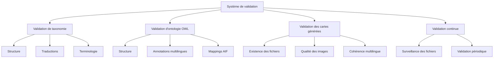

# Système de Validation d'Argumentum

Ce document détaille le système de validation utilisé dans le projet Argumentum pour assurer la qualité et la cohérence des données, des ontologies et des cartes générées.

## Vue d'ensemble du système de validation

Le système de validation d'Argumentum est composé de plusieurs composants qui vérifient différents aspects du projet :



Chaque composant de validation peut être exécuté indépendamment via des options de ligne de commande ou dans le cadre d'un processus de validation continue.

## Tests de validation de la taxonomie

La validation de la taxonomie est gérée par la classe `TaxonomyValidationTests` et configurée via `TaxonomyValidatorConfig`.

### Configuration

```csharp
public class TaxonomyValidatorConfig
{
    public bool ValidateStructure { get; set; } = true;
    public bool ValidateTranslations { get; set; } = true;
    public bool ValidateTerminology { get; set; } = true;
    // ...
}
```

### Types de validation

#### Validation de structure

La validation de structure vérifie :
- L'unicité des identifiants
- La cohérence de la hiérarchie (Famille > Sous-Famille > Soussousfamille)
- La présence des champs obligatoires
- La validité des références croisées

Exemple de test :
```csharp
public async Task ValidateIdUniqueness()
{
    var fallacies = await LoadTaxonomyData();
    var duplicateIds = fallacies
        .GroupBy(f => f.Id)
        .Where(g => g.Count() > 1)
        .Select(g => g.Key)
        .ToList();
    
    Assert.IsEmpty(duplicateIds, $"Les IDs suivants sont dupliqués : {string.Join(", ", duplicateIds)}");
}
```

#### Validation des traductions

La validation des traductions vérifie :
- La présence des traductions pour tous les champs requis
- La cohérence des traductions entre les différentes langues
- La longueur appropriée des textes traduits

Exemple de test :
```csharp
public async Task ValidateTranslationCompleteness()
{
    var fallacies = await LoadTaxonomyData();
    var missingTranslations = new List<string>();
    
    foreach (var fallacy in fallacies)
    {
        if (!string.IsNullOrEmpty(fallacy.TextFr) && string.IsNullOrEmpty(fallacy.TextEn))
            missingTranslations.Add($"Traduction anglaise manquante pour {fallacy.Id} (Text)");
        // Autres vérifications...
    }
    
    Assert.IsEmpty(missingTranslations, $"Traductions manquantes : {string.Join(", ", missingTranslations)}");
}
```

#### Validation de la terminologie

La validation de la terminologie vérifie :
- La cohérence des termes utilisés dans les traductions
- Le respect des conventions de nommage
- La cohérence des références aux concepts spécifiques

Exemple de test :
```csharp
public async Task ValidateTerminologyConsistency()
{
    var fallacies = await LoadTaxonomyData();
    var terminologyIssues = new List<string>();
    
    var termMapping = LoadTerminologyMapping();
    foreach (var fallacy in fallacies)
    {
        foreach (var term in termMapping)
        {
            if (fallacy.TextFr.Contains(term.Key) && !fallacy.TextEn.Contains(term.Value))
                terminologyIssues.Add($"Incohérence terminologique pour {fallacy.Id} : '{term.Key}' devrait être traduit par '{term.Value}'");
        }
    }
    
    Assert.IsEmpty(terminologyIssues, $"Problèmes de terminologie : {string.Join(", ", terminologyIssues)}");
}
```

## Tests de validation de l'ontologie OWL

La validation de l'ontologie OWL est gérée par la classe `OwlOntologyValidationTests` et configurée via `OwlValidatorConfig`.

### Configuration

```csharp
public class OwlValidatorConfig
{
    public bool ValidateStructure { get; set; } = true;
    public bool ValidateMultilingualAnnotations { get; set; } = true;
    public bool ValidateAIFMappings { get; set; } = true;
    // ...
}
```

### Types de validation

#### Validation de structure

La validation de structure vérifie :
- La validité syntaxique de l'ontologie
- La cohérence des classes et des propriétés
- L'absence de cycles dans la hiérarchie
- La validité des restrictions et des axiomes

#### Validation des annotations multilingues

La validation des annotations multilingues vérifie :
- La présence d'annotations dans toutes les langues requises
- La cohérence des annotations entre les différentes langues
- La correspondance entre les annotations et la taxonomie

#### Validation des mappings AIF

La validation des mappings AIF (Argument Interchange Format) vérifie :
- La correspondance entre l'ontologie Argumentum et l'ontologie AIF
- La validité des mappings entre les concepts
- La cohérence des relations entre les concepts mappés

## Tests de validation des cartes générées

La validation des cartes générées est gérée par la classe `CardGenerationValidationTests` et configurée via `CardValidatorConfig`.

### Configuration

```csharp
public class CardValidatorConfig
{
    public bool ValidateFileExistence { get; set; } = true;
    public bool ValidateImageQuality { get; set; } = true;
    public bool ValidateMultilingualConsistency { get; set; } = true;
    // ...
}
```

### Types de validation

#### Validation de l'existence des fichiers

La validation de l'existence des fichiers vérifie :
- La présence de tous les fichiers de cartes attendus
- La correspondance entre les fichiers générés et la taxonomie
- La structure correcte des répertoires de sortie

Exemple de test :
```csharp
public async Task ValidateCardFilesExistence()
{
    var fallacies = await LoadTaxonomyData();
    var missingFiles = new List<string>();
    
    foreach (var fallacy in fallacies)
    {
        foreach (var language in _config.Languages)
        {
            string expectedFilePath = GetExpectedCardFilePath(fallacy.Id, language);
            if (!File.Exists(expectedFilePath))
                missingFiles.Add($"Fichier de carte manquant pour {fallacy.Id} en {language} : {expectedFilePath}");
        }
    }
    
    Assert.IsEmpty(missingFiles, $"Fichiers manquants : {string.Join(", ", missingFiles)}");
}
```

#### Validation de la qualité des images

La validation de la qualité des images vérifie :
- La résolution appropriée des images
- L'absence d'artefacts de compression
- La lisibilité du texte sur les cartes
- La cohérence visuelle entre les différentes langues

#### Validation de la cohérence multilingue

La validation de la cohérence multilingue vérifie :
- La cohérence des éléments visuels entre les différentes versions linguistiques
- La correspondance des traductions entre la taxonomie et les cartes générées
- L'adaptation correcte des mises en page pour les différentes langues

## Système de validation continue

Le système de validation continue est géré par la classe `ContinuousValidationSystem` et configuré via `ContinuousValidationConfig`.

### Configuration

```csharp
public class ContinuousValidationConfig
{
    public bool ValidateOnChanges { get; set; } = true;
    public int ValidationInterval { get; set; } = 60; // minutes
    public bool ValidateTaxonomy { get; set; } = true;
    public bool ValidateOwl { get; set; } = true;
    public bool ValidateCards { get; set; } = true;
    // ...
}
```

### Fonctionnalités

#### Surveillance des fichiers

Le système surveille les modifications des fichiers pertinents et déclenche automatiquement les validations appropriées lorsque des changements sont détectés.

```csharp
private void SetupFileWatchers()
{
    // Surveiller les fichiers de taxonomie
    var taxonomyWatcher = new FileSystemWatcher(Path.GetDirectoryName(_taxonomyFilePath));
    taxonomyWatcher.Filter = Path.GetFileName(_taxonomyFilePath);
    taxonomyWatcher.Changed += OnTaxonomyFileChanged;
    taxonomyWatcher.EnableRaisingEvents = true;
    
    // Autres watchers...
}

private void OnTaxonomyFileChanged(object sender, FileSystemEventArgs e)
{
    if (_config.ValidateTaxonomy)
        RunTaxonomyValidation();
}
```

#### Validation périodique

Le système exécute périodiquement des validations complètes selon l'intervalle configuré.

```csharp
private async Task RunPeriodicValidation()
{
    while (!_cancellationToken.IsCancellationRequested)
    {
        await Task.Delay(TimeSpan.FromMinutes(_config.ValidationInterval), _cancellationToken);
        
        if (_config.ValidateTaxonomy)
            await RunTaxonomyValidation();
        
        if (_config.ValidateOwl)
            await RunOwlValidation();
        
        if (_config.ValidateCards)
            await RunCardValidation();
    }
}
```

## Intégration avec le système de génération

Le système de validation est intégré au processus de génération des cartes pour assurer la qualité des assets produits :

1. **Validation préalable** : Avant la génération, la taxonomie et l'ontologie sont validées.
2. **Validation pendant la génération** : Des vérifications sont effectuées pendant le processus de génération.
3. **Validation post-génération** : Une validation complète est effectuée après la génération des cartes.

## Conclusion

Le système de validation d'Argumentum assure la qualité et la cohérence des données, des ontologies et des cartes générées. Il combine des validations statiques et dynamiques pour détecter les problèmes à différentes étapes du processus de génération.

Pour plus d'informations sur la couverture des traductions, consultez le document [TranslationCoverage.md](TranslationCoverage.md).