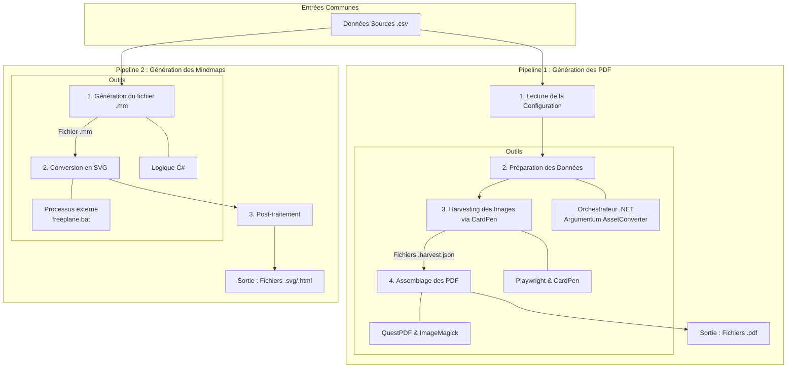

# Documentation du Pipeline de Génération d'Assets

Ce document est la source de vérité décrivant le fonctionnement complet du pipeline de génération d'assets pour le projet Argumentum. Il couvre la génération des cartes PDF "Print & Play" ainsi que celle des Mindmaps interactives.

## 1. Vue d'Ensemble des Pipelines

Le système de génération est composé de deux pipelines principaux qui partagent les mêmes données sources mais utilisent des chaînes d'outils différentes pour produire des artefacts distincts.



## 2. Description Détaillée du Pipeline PDF

Le pipeline de génération PDF est le flux de travail principal, responsable de la création des documents "Print & Play". Il est orchestré entièrement par l'application console .NET `Argumentum.AssetConverter`.

### Étape 2.1 : Configuration et Lancement

Le pipeline est lancé via l'exécutable `Argumentum.AssetConverter.exe`. Aucune commande complexe n'est nécessaire, car toute la logique est définie dans le fichier de configuration central.

```powershell
# Exemple de commande pour lancer la génération
cd Generation/Converters/Argumentum.AssetConverter/bin/Debug/net8.0/
./Argumentum.AssetConverter.exe
```

Le processus commence par lire et interpréter le fichier [`AssetConverterConfig.json`](Generation/Converters/Argumentum.AssetConverter/bin/Debug/net8.0/AssetConverterConfig.json:1). Ce fichier est le cerveau de l'opération et définit :
-   **`DataSets`** : Des pointeurs vers les fichiers de données brutes, principalement des `.csv`.
    -   *Exemple :* Le `DataSet` "Rules" pointe vers le fichier [`Cards/Rules/Argumentum Rules - Cards.csv`](Cards/Rules/Argumentum%20Rules%20-%20Cards.csv).
-   **`CardSets`** : Des ensembles de cartes qui lient un `DataSet` à un fichier de gabarit `.json`.
    -   *Exemple :* Le `CardSet` "Rules" utilise le gabarit [`Cards/Rules/Argumentum_Rules_fr.json`](Cards/Rules/Argumentum_Rules_fr.json:1).

### Étape 2.2 : "Harvesting" via CardPen et Playwright

Cette phase est gérée par la classe [`HarvestManager.cs`](Generation/Converters/Argumentum.AssetConverter/WebBasedGenerator/Cardpen/HarvestManager.cs). Son rôle est de générer une image pour chaque carte.

1.  **Préparation des Données :** Pour chaque carte, le `HarvestManager` lit le gabarit `.json` et y injecte les données du `.csv` correspondant.
2.  **Automatisation du Navigateur :** Une instance de Chromium est lancée en arrière-plan avec **Playwright**.
3.  **Injection dans CardPen :** Le navigateur charge l'application web `CardPen`. Le `HarvestManager` simule ensuite un "upload" de fichier, envoyant le JSON (contenant le gabarit et les données) à `CardPen`.
4.  **Capture d'Image :** Le script attend que `CardPen` génère le HTML de la carte, puis simule un clic pour convertir ce HTML en une image PNG. L'image est récupérée sous forme de chaîne **Base64** directement depuis le DOM.
5.  **Stockage Intermédiaire :** Toutes les chaînes Base64 des images d'un `CardSet` sont sauvegardées dans un fichier `.harvest.json` dans le répertoire `Target/Harvest/`.

### Étape 2.3 : Assemblage du PDF

Cette phase finale est gérée par `PdfManager.cs` (logique décrite dans [`Analyse_Generation_PDF.md`](Generation/Documentation/Analyse_Generation_PDF.md)).

1.  **Lecture de la Récolte :** Le `PdfManager` lit les fichiers `.harvest.json` générés à l'étape précédente.
2.  **Décodage des Images :** La bibliothèque **ImageMagick** est utilisée pour décoder les chaînes Base64 en images bitmap. C'est également à cette étape que la conversion colorimétrique (RVB -> CMJN) est effectuée pour les besoins de l'impression professionnelle.
3.  **Composition du Document :** La bibliothèque **QuestPDF** est utilisée pour créer le document final. Elle prend les images, les agence sur des pages (selon le format, ex: A4), gère la mise en page (marges, nombre de colonnes) et l'ordre des pages pour les formats "Print & Play".
4.  **Sauvegarde :** Le fichier PDF final est sauvegardé dans le répertoire `Target/Documents/`.

## 3. Description Détaillée du Pipeline Mindmap

Le pipeline de génération des Mindmaps est un processus distinct qui s'exécute en parallèle. Il transforme les données taxonomiques en une carte mentale interactive au format SVG.

### Étape 3.1 : Génération du Fichier `.mm`

Cette étape est gérée par la logique C# au sein de l'orchestrateur.

1.  **Lecture des Données :** Le processus lit les mêmes fichiers `.csv` que le pipeline PDF, par exemple [`Cards/Fallacies/Argumentum Fallacies - Taxonomy.csv`](Cards/Fallacies/Argumentum%20Fallacies%20-%20Taxonomy.csv).
2.  **Construction de l'Arbre :** La logique applicative (ex: `FallacyMindMapCreatorConfig`) parcourt les lignes du CSV et construit une structure de données en mémoire qui représente la hiérarchie de la mindmap.
3.  **Sérialisation XML :** La structure en mémoire est sérialisée en un fichier `.mm`. Il s'agit d'un format de fichier XML spécifique, compatible avec le logiciel **Freeplane** (et Freemind).
    -   *Exemple de sortie :* [`Cards/Fallacies/Mindmaps/fallacy_map.mm`](Cards/Fallacies/Mindmaps/fallacy_map.mm)

### Étape 3.2 : Conversion en SVG via un Processus Externe

L'application .NET ne convertit pas directement le `.mm` en SVG. Elle délègue cette tâche à un outil externe.

1.  **Appel de la Commande :** L'orchestrateur exécute une commande pour lancer l'outil Freeplane en ligne de commande.
    ```powershell
    # Le chemin vers l'exécutable est défini dans le fichier de configuration
    # Exemple de commande (simplifiée) exécutée par l'application
    & "C:\Program Files (x86)\Freeplane\freeplane.bat" -X ConvertToSVG -S "<chemin_entree.mm>" "<chemin_sortie.svg>"
    ```
2.  **Fichier de sortie :** Cette commande produit un fichier `.svg` brut à partir de la carte mentale.

### Étape 3.3 : Post-traitement et Intégration HTML

Le fichier `.svg` brut est souvent insuffisant. Une étape de post-traitement est nécessaire pour le rendre interactif.

1.  **Modification du SVG :** Des scripts peuvent modifier le SVG pour ajouter des attributs `id` uniques aux nœuds, basés sur les données d'origine, afin de permettre une liaison fiable avec l'interface utilisateur.
2.  **Intégration HTML :** Le SVG final est souvent intégré dans des fichiers HTML qui fournissent le contexte et le code JavaScript pour l'interactivité (zoom, affichage d'informations au clic, etc.).
    -   *Exemple :* [`Cards/Fallacies/Mindmaps/included.html`](Cards/Fallacies/Mindmaps/included.html)

## 4. Rôle de la Validation Automatisée

La fiabilité des deux pipelines est assurée par une suite de tests automatisés située dans le projet [`Argumentum.AssetConverter.Tests`](Generation/Converters/Argumentum.AssetConverter.Tests/Argumentum.AssetConverter.Tests.csproj). La stratégie se concentre sur la validation des données et des processus, et non sur le rendu visuel.

-   **Validation du Parsing :** Des tests comme [`Parsing/CsvParserTests.cs`](Generation/Converters/Argumentum.AssetConverter.Tests/Parsing/CsvParserTests.cs) s'assurent que les données `.csv` sont lues correctement dès le début du processus.
-   **Validation de la Génération d'Image :** Des tests d'intégration comme [`ImageConversion/HtmlToPngConverterTests.cs`](Generation/Converters/Argumentum.AssetConverter.Tests/ImageConversion/HtmlToPngConverterTests.cs) vérifient que l'étape de conversion HTML vers PNG via Playwright est fonctionnelle.
-   **Validation de la Génération Mindmap :** Des tests unitaires dans [`MindmapGeneration/MmGeneratorTests.cs`](Generation/Converters/Argumentum.AssetConverter.Tests/MindmapGeneration/MmGeneratorTests.cs) valident la conformité XML du fichier `.mm` généré et l'intégrité des données qui y sont inscrites.
-   **Validation de l'Assemblage PDF :** Des tests d'intégration de bout en bout comme [`PdfAssembly/PdfAssemblerTests.cs`](Generation/Converters/Argumentum.AssetConverter.Tests/PdfAssembly/PdfAssemblerTests.cs) génèrent des images de test et les assemblent en un PDF, puis utilisent la librairie `PdfPig` pour vérifier l'intégrité du document final (ex: nombre de pages).