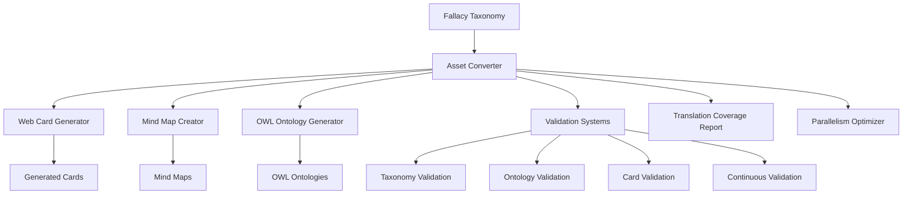

# Argumentum: The Art of Argumentation

Welcome to Argumentum, a captivating card game that celebrates the intricate art of argumentation. This project not only involves the creation and distribution of the end product but also aims to facilitate content updating with ease.

Discover more about the game (currently in French) on the project's [website](https://www.argumentum.games).

## Project Overview

Argumentum is an educational project that aims to teach the art of argumentation and raise awareness of fallacies through a card game. The project includes a complete system for generating cards, documentation, and validation in several languages (French, English, Russian, and Portuguese).

The system is composed of several interconnected components:

## Repository Structure

The repository is organized as follows:

- **[Generation](/Generation)**: Contains the core tools for the generation workflow:
    - **[CardPen](/Generation/CardPen/index.html)**: A tailored version of [M.C DeMarco](https://github.com/mcdemarco/)'s cardpen, used to generate templated cards from CSV data.
    - **[Converters](/Generation/Converters)**: A command-line utility that processes and assembles Cardpen scenarios to create print-ready documents.

- **[Cards](/Cards)**: Houses Cardpen configurations for the different decks in Argumentum, including assets for each card type.

- **[DNNPlatform](/DNNPlatform)**: The web application for the Argumentum website, built on DNN ASP.Net with 2Sxc and Open-store extensions.

## How to Contribute

We are open to contributions of many kinds. You don't have to be a developer to give a hand.

### Text Contributions

If you're interested in helping with the data at the heart of this project, consider contributing to these Google spreadsheets:

* [Argumentum Fallacies](https://docs.google.com/spreadsheets/d/1TrQUyzXMMM-9pHdNWz1fdJ3xQ5XcHgwVH52SOnM61ow/edit?usp=sharing)
* [Argumentum Scenarii](https://docs.google.com/spreadsheets/d/1SQb9R7Dpi0jPz2JX-HXk1WFn9t68e3aq9MCGif7lM10/edit?usp=sharing)
* [Argumentum Rules](https://docs.google.com/spreadsheets/d/1jnhlod6PLgvVI-Qgrz3sTYytMgnrMyZrHcc8htPn_DQ/edit?usp=sharing)
* [Argumentum Virtues](https://docs.google.com/spreadsheets/d/1Asxe0Kb3_pLUSWJnB1HNiBG_EOaz_oU_X3eO9ixnVhA/edit?usp=sharing)

The content is regularly exported to CSV files in this repository. Direct Pull Requests are also welcome.

#### Translations and Improvements

We aim to distribute our material to the widest possible audience. If you are fluent in a language not yet available, please let us know. We also welcome corrections and improvements to existing translations and content.

## Generating Cards and Documents

The generation tool is a .Net 7.0 console application. For detailed instructions on how to run it, please refer to the [Developer Guide](/Generation/Converters/Argumentum.AssetConverter/Documentation/DeveloperGuide.md).

### Quick Start for Developers

If you'd like to customize the app's behavior, clone this repository, build the app, and run it in Debug mode.

**Requirements:**

*   Visual Studio or JetBrains Rider
*   .NET 7.0

Load the "Argumentum Converters.sln" solution, build and run the included C# console project. For more detailed instructions, please refer to the [Developer Guide](/Generation/Converters/Argumentum.AssetConverter/Documentation/DeveloperGuide.md).

### Automatic Configuration File Generation

The `Argumentum.AssetConverter` application uses a configuration file named `AssetConverterConfig.json` to control its behavior.

If this file is missing when the application starts, it will be automatically generated with default values. These defaults are sourced directly from the `AssetConverterConfig.cs` file within the project.

To restore the default configuration, you can simply delete or rename the existing `AssetConverterConfig.json` file. A new one will be created with the default settings the next time you run the application.

## How to build the website

The DNN website's data and decryption key are not included in the current commit. If you're interested in running a copy of Argumentum.games, please contact us.

## License

The project is licensed under the LGPL-3.0 license. See the [LICENSE](/LICENSE) file for more details.

## Contact

You can contact the project maintainers via the [issues](/issues) page.

## Acknowledgements

The project is based on the work of [M.C DeMarco's cardpen](https://github.com/mcdemarco/cardpen).

### Changelog

#### Spectre.Console Update

The `Argumentum.AssetConverter` application was encountering an error related to the `System.Diagnostics.StackTrace` dependency when using `AnsiConsole.WriteException()` from Spectre.Console. To resolve this, `Spectre.Console` was updated from version 0.47.0 to 0.50.0. The `run_without_stacktrace_error.bat` script is no longer needed.

#### Parallel PDF Generation Fix

A `DocumentDrawingException` was occurring due to a thread-safety issue in the QuestPDF library when generating multiple PDF documents in parallel. The issue was resolved by introducing a `lock` statement around the `PdfManager.GenerateDocument` call, ensuring that only one PDF is generated at a time, while still benefiting from parallelism for other tasks.
