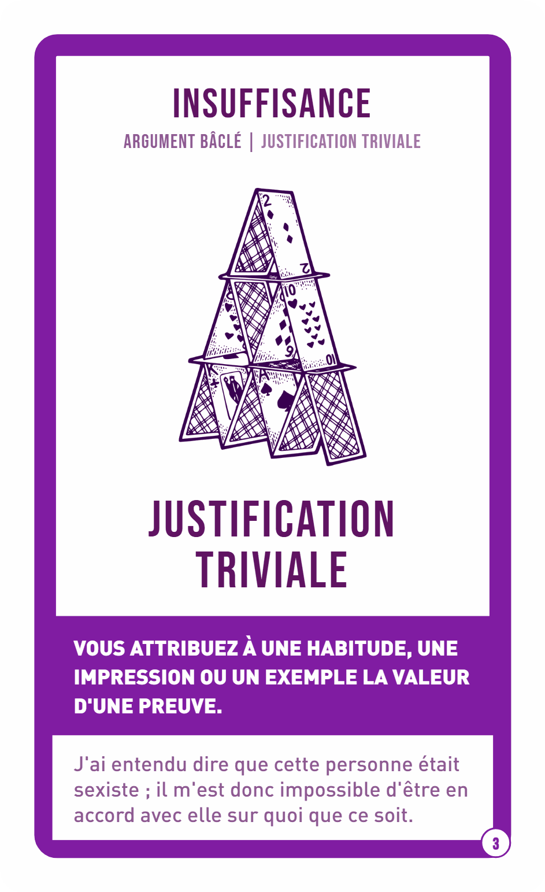
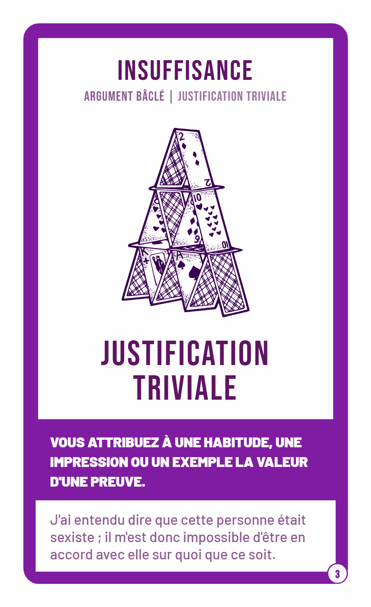
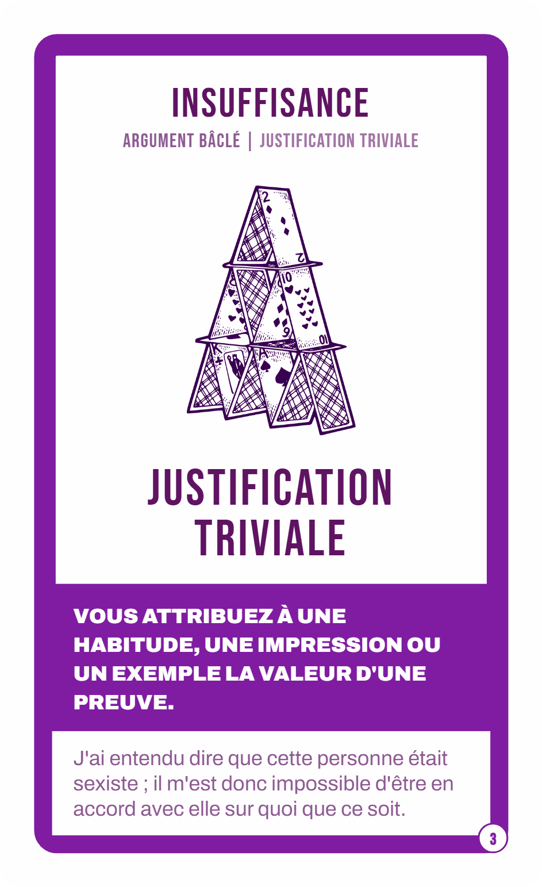
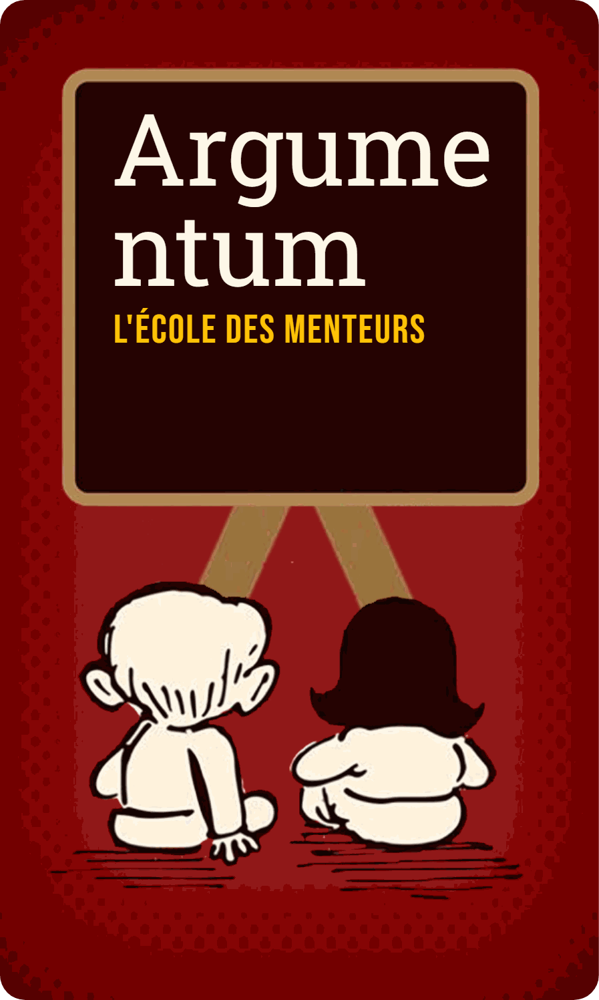

# Substitution des polices exposées — table et rendus comparatifs

Item « **table de substitution** DINPro → permissive (+ TrendSlab), avec rendu comparatif sur faces réelles » du `#1485`.

Ce document ne décide **pas** de la licence (item 3.a, owner) et ne modifie **aucun gabarit** (item 3.b, post-tag). Il mesure ce qu'une substitution coûterait *visuellement*, pour que la décision se prenne sur des chiffres et des rendus plutôt que sur une intuition typographique.

---

## 1. Méthode

Les rendus ne sont **pas** des maquettes : ils sortent du **vrai moteur CardPen**, celui de la chaîne de production, piloté selon le protocole de [`HarvestManager.cs`](../../../Generation/Converters/Argumentum.AssetConverter/WebBasedGenerator/Cardpen/HarvestManager.cs) (attendre `typeof cardpen`, `cardpen.form.set`, `cardpen.write.generate`, puis dans l'iframe `#cpOutput` : `#generateButton` → `generateImages()` → `#zipButton`).

Les cartes sont les **vraies lignes CSV** des gabarits, avec leurs illustrations réelles. Rien n'est simulé ni retouché.

Trois mesures, toutes falsifiables :

1. **Ce qui est réellement téléchargé** — `document.fonts` dans le document de rendu, après peinture. Dit quelles faces le navigateur est allé chercher, et lesquelles il n'a jamais demandées.
2. **La mise en page** — hauteur des blocs texte et **nombre de lignes** (obtenu par `Range.getClientRects()`, pas par division d'une hauteur : une valeur qui ne dépend d'aucune constante devinée), sur un échantillon de 23 cartes.
3. **La couverture des glyphes** — `cmap` de chaque police candidate lue avec `fontTools`, confrontée aux caractères des **seules colonnes que le mustache peint** (85 caractères, et non les 174 du CSV : les colonnes russes existent mais ne sont pas rendues).

Le bloc de substitution **redeclare le nom d'origine** (`'DINpro'`, `'TrendSlabW00-Four'`) : aucun sélecteur du gabarit n'est touché, seuls les `@font-face` changent. Le diff est minimal et se défait en retirant le bloc.

---

## 2. Ce que le gabarit télécharge réellement

Le gabarit Fallacies déclare **4** `@font-face` `'DINPro'` (poids 300 / 500 / 700 / 900), tous pointant `fonts.cdnfonts.com`.

**Mesuré** : seuls **deux** sont jamais récupérés.

| Carte | Faces effectivement chargées |
|---|---|
| sans exemple | `DINPro 900` |
| avec exemple | `DINPro 500` **+** `DINPro 900` |

- `.desc_fr` déclare `font-weight: 900` → **900**, sur toutes les cartes.
- `.exemple_fr` ne déclare **aucun** `font-weight` → la demande est 400, absente du jeu → le navigateur retombe sur le **500**.

Les poids **300 et 700 sont déclarés et jamais demandés** : quatre blocs `@font-face` sont donc inutiles, et la substitution n'a à couvrir que **deux** poids pour ne rien changer.

> Détail à ne pas perdre : les blocs déclarent `'DINPro'` (P majuscule) alors que `.desc_fr` et `.exemple_fr` demandent `'DINpro'` (p minuscule). Cela fonctionne — l'appariement des noms de famille est insensible à la casse — mais tout outil qui retirerait ces blocs par recherche sensible à la casse n'en retirerait **aucun**, et le candidat ne gagnerait que par l'ordre de cascade. `mesurer_substitution.py` apparie sans tenir compte de la casse, et le vérifie : `@font-face DINpro remplaces : 4`.

---

## 3. DINPro — candidats et effet mesuré

23 cartes de `Cards/Fallacies/Argumentum_Fallacies_Face_fr.json` (16 avec exemple, 7 sans), 4 configurations.

| Candidat | Licence | `.desc_fr` change | `.exemple_fr` change | Sens de l'écart |
|---|---|---|---|---|
| **Barlow** | OFL 1.1 | **0 / 23** | 2 / 23 | toujours **−1 ligne** (plus compact) |
| Archivo | OFL 1.1 | 14 / 23 | 2 / 23 | **+1 ligne** sur `.desc_fr` |
| Inter | OFL 1.1 | 8 / 23 | 5 / 23 | **+1 ligne**, sur les deux blocs |

Hauteurs moyennes, sur le même échantillon :

| Configuration | `.desc_fr` | `.exemple_fr` | lignes `.desc_fr` |
|---|---|---|---|
| référence (DINPro) | 64,1 px | 60,3 px | 2,91 |
| **Barlow** | **64,1 px** | 58,6 px | **2,91** |
| Archivo | 73,9 px | 58,6 px | 3,52 |
| Inter | 69,7 px | 64,6 px | 3,26 |

**Aucune carte ne déborde de sa racine dans aucune configuration** — `scrollHeight - clientHeight > 1` sur le nœud `card`, faux sur les **92** mesures (23 cartes × 4 configurations). La croissance d'Archivo est absorbée par la mise en page, elle ne casse rien ; elle se voit, c'est tout. (Le conteneur `.body` présente un écart `scroll/client` de 2 px **déjà dans la référence** : état préexistant, à ne pas imputer à une substitution.)

### Rendu comparatif — carte PK=3, qui exerce les deux poids

`.desc_fr` (900) en blanc sur violet, `.exemple_fr` (500) en violet sur blanc.

| Référence — DINPro 900 + 500 | Barlow | Archivo |
|---|---|---|
|  |  |  |

Barlow tient `.desc_fr` sur 3 lignes comme la référence ; **Archivo en demande une quatrième** (« VOUS ATTRIBUEZ À UNE / HABITUDE, UNE IMPRESSION OU / … » → 4 lignes).

### Verdict

**Barlow** est le seul candidat qui **ne change aucune** description sur l'échantillon. C'est aussi un dérivé DIN assumé, ce qui explique la proximité. Il subsiste un écart sur 2 cartes, toujours dans le sens d'un exemple **plus compact** (4→3 et 3→2 lignes), sans débordement ni texte perdu.

**Archivo et Inter** sont écartés : tous deux allongent systématiquement un bloc, et cet allongement est le changement que la revue visuelle attrape immédiatement.

---

## 4. TrendSlab — le cas qui ne se substitue pas

`TrendSlabW00-Four` n'apparaît que dans **2** gabarits (`Cards/Rules/Argumentum_Rules_fr.json` et sa variante `Print_and_Play`), avec **6** URL sources vers `db.onlinewebfonts.com`. Il porte le `h1` des cartes de règles — la manchette « ARGUMENTUM ».

**Trois candidats slab éprouvés** (Roboto Slab, Bitter, Zilla Slab — tous permissifs) **échouent tous de la même façon** :

| Référence — TrendSlabW00-Four | Roboto Slab |
|---|---|
|  |  |

La référence rend `Argumentum` en **capitales** et avec une **texture hachurée**. Les trois candidats le rendent en **bas de casse**, **sans texture**, et la césure se déplace (« ARGU/MENT/UM » → « Argume/ntum »).

**Vérifié contre la source** : le `h1` ne porte **ni** `text-transform: uppercase` **ni** `text-shadow` dans le CSS du gabarit. Les deux traits viennent donc des **glyphes eux-mêmes** — TrendSlabW00-Four est une capitale décorative, pas un serif à empattements ordinaire.

**Conséquence** : « substituer TrendSlab par un slab permissif » n'est pas un changement de police, c'est un **changement de design**. Aucun des trois candidats ne conserve l'identité de la manchette. La voie correcte est différente — trouver une capitale décorative hachurée sous licence permissive, ou traiter TrendSlab à part dans la revue de licence — et cela sort du périmètre de cette table.

---

## 5. Couverture des glyphes

Sur les **85 caractères réellement peints** (colonnes référencées par le mustache) :

| Police | Points de code servis | Manquants sur le corpus |
|---|---|---|
| DINPro (origine) | 557 | **0** |
| Barlow | 471 | 1 |
| Archivo | 560 | 1 |
| Inter | 1 622 | 0 |

Le caractère manquant est **`с` (U+0441, cyrillique)** — et c'est une **coquille dans les données**, pas un besoin légitime :

```
PK=611  colonne desc_fr  "…la fausseté d'une con**с**lusion…"
```

Un `с` cyrillique s'est glissé à la place du `c` latin. DINPro le couvre (d'où l'invisibilité de la coquille aujourd'hui) ; Barlow et Archivo ne le couvrent pas et le rendraient depuis une police de repli, ce qui produirait un glyphe d'une autre fonte **au milieu d'un mot**. Inter le couvre, ce qui masquerait la coquille.

**Signalé hors périmètre** : la correction est dans le CSV (`Cards/Fallacies/Argumentum_Fallacies_Face_fr.json`, ligne PK=611) et mérite sa propre PR. Une fois la coquille corrigée, les trois candidats couvrent l'intégralité du corpus français.

---

## 6. Ce que ce document ne dit pas

- **Il ne tranche pas la question de licence.** Il chiffre le coût d'une substitution, il ne dit pas si elle est nécessaire (item 3.a).
- **Il ne modifie aucun gabarit vivant**, aucun CSV, aucun PDF. Le contenu de `Cards/` est lu, jamais écrit.
- **Il ne juge pas la beauté.** Barlow conserve les *césures* ; deux fontes peuvent casser identiquement et rester visiblement différentes. Le rendu comparatif est là pour la partie que les chiffres ne portent pas.
- **Il ne couvre pas `big-john-pro`** (point 4 de l'issue, porté par une autre lane) ni les familles déclarées sans `@font-face`.
- **L'échantillon est de 23 cartes sur 169.** Il est étalé sur tout le corpus, pas exhaustif.

---

## 7. Reproduire

```bash
pip install playwright fonttools && playwright install chromium

# 1. construire un bloc de substitution (woff2 embarques, aucun reseau au rendu)
python mesurer_substitution.py css --famille Barlow --nom DINpro \
    --sortie /tmp/dinpro_Barlow.css

# 2. rendre une face reelle et dire quelles polices l'ont peinte
python mesurer_substitution.py rendre \
    --gabarit ../../../Cards/Fallacies/Argumentum_Fallacies_Face_fr.json \
    --css-police /tmp/dinpro_Barlow.css --pk 3 --tag barlow --sortie /tmp/img --sonde

# 3. chiffrer l'effet sur un echantillon
python mesurer_substitution.py mesurer \
    --gabarit ../../../Cards/Fallacies/Argumentum_Fallacies_Face_fr.json \
    --pks 2,73,134,219,314,487,524,559,608,645,677,705,757,825,893,939,1,155,486,578,668,742,892 \
    --config "REFERENCE=" --config "Barlow=/tmp/dinpro_Barlow.css" \
    --config "Archivo=/tmp/dinpro_Archivo.css" --sortie /tmp/mesures.json

# 4. couverture des glyphes sur le corpus peint
python mesurer_substitution.py couverture \
    --gabarit ../../../Cards/Fallacies/Argumentum_Fallacies_Face_fr.json \
    --familles Barlow Archivo Inter
```

`cardpen` doit être joignable à l'adresse de `WebBasedGeneratorConfig.LocalCardpenUrl` (`https://argumentum.myia.io/index.html`).

---

*po-2023 — 2026-09-30*